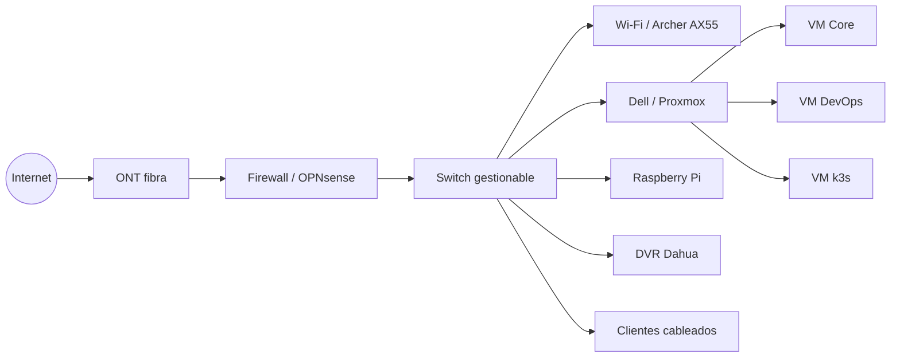

# Topología lógica objetivo

La siguiente topología representa el estado objetivo, no obliga a disponer de todos los componentes desde el día uno.



## Etapa inicial sin firewall dedicado

Mientras OPNsense no exista, el Archer AX55 puede seguir siendo gateway. La documentación debe permitir una transición ordenada en lugar de forzar una migración prematura.

```text
Internet -> ONT -> Archer AX55 -> switch -> homelab
```

Cuando incorporemos OPNsense:

```text
Internet -> ONT -> OPNsense -> switch -> LAN/VLAN
                               -> Archer AX55 en rol AP/mesh
```

La viabilidad exacta del modo AP/mesh debe validarse con la configuración final de los AX55.

## Separación lógica objetivo

Un esquema simple de VLAN de referencia:

| VLAN | Nombre | Ejemplo | Uso |
|---:|---|---|---|
| 10 | MGMT | `192.168.10.0/24` | Proxmox, switch, firewall |
| 20 | SERVERS | `192.168.20.0/24` | VMs y servicios |
| 30 | IOT | `192.168.30.0/24` | IoT/Home Assistant |
| 40 | CCTV | `192.168.40.0/24` | DVR/cámaras |
| 50 | CLIENTS | `192.168.50.0/24` | PCs y móviles |
| 60 | GUEST | `192.168.60.0/24` | invitados |
| 70 | LAB | `192.168.70.0/24` | pruebas destructivas |

:::note
Estas subredes son un diseño de referencia. Antes de aplicarlas se debe revisar la red doméstica actual para evitar solapamientos.
:::
