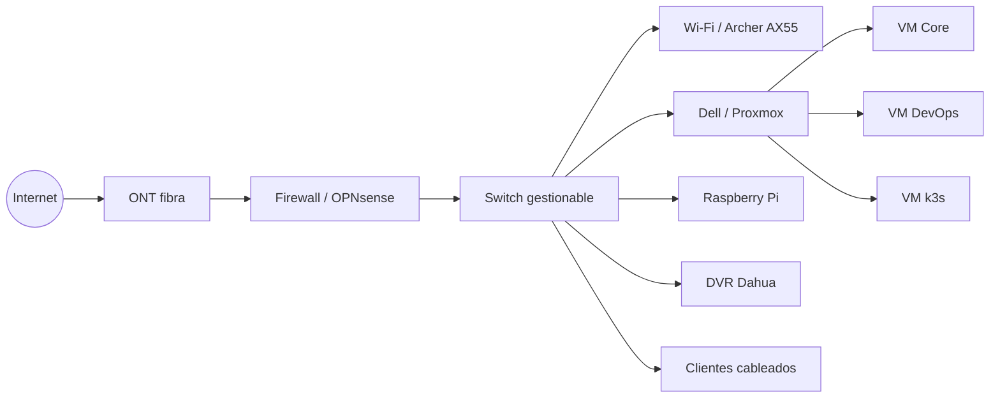
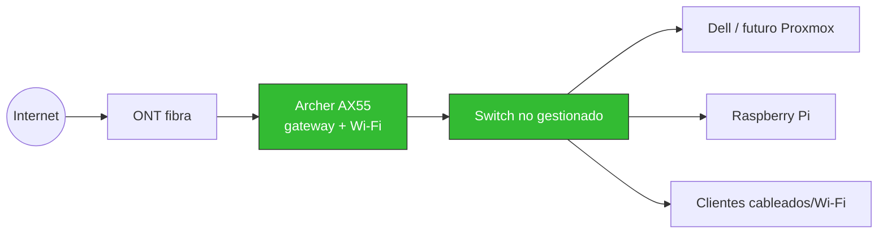
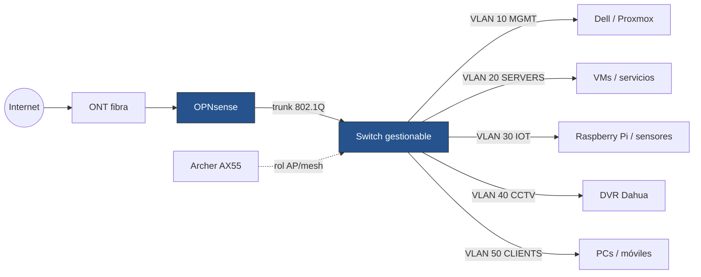

# Topología lógica objetivo

La siguiente topología representa el estado objetivo, no obliga a disponer de todos los componentes desde el día uno.

## Etapa 1 · sin firewall dedicado (estado actual)

Mientras OPNsense no exista, el Archer AX55 sigue siendo gateway y no hay segmentación: todo comparte una sola red plana. La documentación debe permitir una transición ordenada en lugar de forzar una migración prematura.

Una sola red significa que todo puede hablarle a todo — es el estado real hoy, no un diseño recomendado.

## Etapa 2 · con OPNsense y VLANs (objetivo)

La viabilidad exacta del modo AP/mesh de los AX55 (como puntos de acceso puros, sin routing propio) debe validarse con su configuración final — no todos los routers de consumo soportan bien un modo "solo AP" con VLANs tageadas.

## Separación lógica objetivo

Un esquema simple de VLAN de referencia:

| VLAN | Nombre | Ejemplo | Uso |
|---:|---|---|---|
| 10 | MGMT | `192.168.10.0/24` | Proxmox, switch, firewall |
| 20 | SERVERS | `192.168.20.0/24` | VMs y servicios |
| 30 | IOT | `192.168.30.0/24` | IoT/Home Assistant |
| 40 | CCTV | `192.168.40.0/24` | DVR/cámaras |
| 50 | CLIENTS | `192.168.50.0/24` | PCs y móviles |
| 60 | GUEST | `192.168.60.0/24` | invitados |
| 70 | LAB | `192.168.70.0/24` | pruebas destructivas |

:::note
Estas subredes son un diseño de referencia. Antes de aplicarlas se debe revisar la red doméstica actual para evitar solapamientos.
:::
