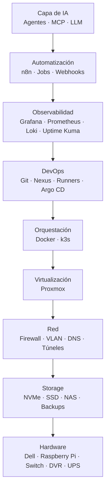
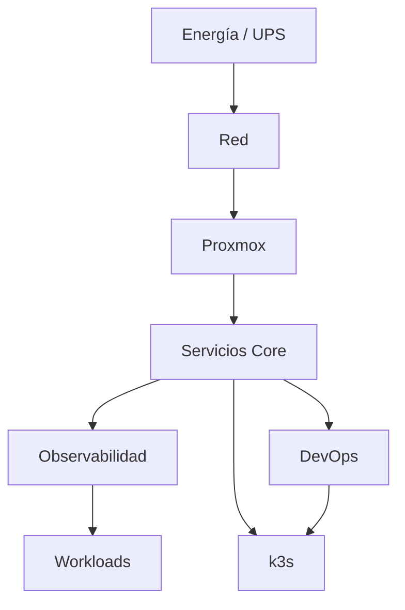

# Arquitectura general

O.S.C.A.R. se diseña por capas. Cada capa debe poder evolucionar sin obligar a reconstruir las demás.

## Plano de control y plano de trabajo

Una distinción útil es separar:

- **control plane del homelab**: DNS, monitoreo, GitOps, secretos, backups y administración;
- **workloads**: aplicaciones, bases de datos, pruebas, proyectos y servicios de laboratorio.

Si una aplicación experimental consume toda la RAM, no debería llevarse con ella DNS, acceso remoto y monitoreo.

## Roles de cómputo

### Dell OptiPlex 7060 Micro

Rol principal objetivo: **host Proxmox**.

Sobre Proxmox viven VMs/LXC con funciones diferenciadas. Un primer reparto razonable es:

| Carga | Tipo sugerido | Motivo |
|---|---|---|
| Docker / servicios core | VM Linux | aislamiento y mantenimiento simple |
| DevOps (Git/Nexus/runners) | VM Linux | carga de I/O y ciclos de actualización propios |
| k3s | 1 o más VMs | laboratorio Kubernetes aislado |
| utilidades pequeñas | LXC | bajo overhead |

No es obligatorio crear todas estas VMs el primer día. La arquitectura permite empezar con una sola VM Docker y dividirla cuando haya una razón concreta.

### Raspberry Pi

Las Raspberry Pi cumplen funciones auxiliares y de edge:

- DNS secundario;
- Home Assistant;
- sensores y telemetría;
- Internet-Pi;
- servicios de baja criticidad;
- nodos de laboratorio ARM.

El principio es no colocar una carga intensiva en una Pi si el Dell puede ejecutarla de forma más estable.

## Dependencias críticas

La documentación debe ayudar a que esta dependencia sea evidente. Por ejemplo, el monitoreo puede observar DNS, pero no debe depender de que una aplicación experimental esté sana.

## Niveles de criticidad

| Nivel | Ejemplos | RTO orientativo | Filosofía |
|---|---|---:|---|
| C0 | firewall, switch, energía | minutos | infraestructura básica |
| C1 | DNS, acceso administrativo | < 1 h | recuperar primero |
| C2 | Home Assistant, Git, monitoreo | horas | backup frecuente |
| C3 | aplicaciones personales | 1 día | restaurables |
| C4 | laboratorios | sin SLA | recrear desde Git |

Los tiempos son objetivos internos, no garantías. Sirven para decidir dónde invertir esfuerzo.
