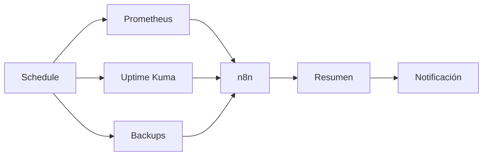

# Informe diario de salud

## Flujo

## Contenido

- nodos caídos;
- CPU/RAM anormales;
- discos > 80%;
- backups recientes;
- servicios reiniciados;
- temperatura máxima;
- cambios relevantes.

La IA puede redactar el resumen, pero la recolección y los umbrales deben ser determinísticos.
