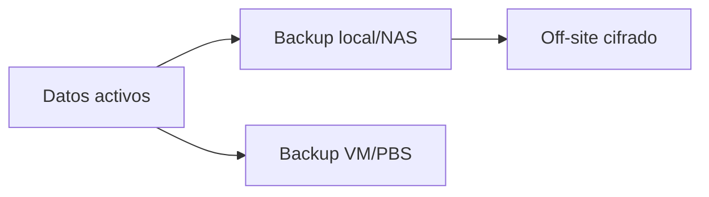
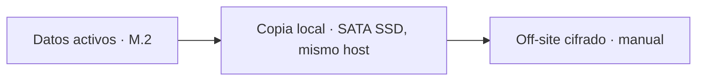

# Backup 3-2-1

Objetivo conceptual:

- **3** copias de los datos importantes;
- **2** medios/ubicaciones diferentes;
- **1** copia off-site.

:::caution Estado actual vs. objetivo
El diagrama y la tabla de abajo describen el **target state**. Hoy O.S.C.A.R. **no tiene NAS** (figura como "decisión pendiente" en el [backlog](../roadmap/backlog.md)) ni copia off-site automatizada. Sin NAS, el esquema real disponible es: disco activo (M.2) + SSD SATA del mismo host como segunda copia local + una copia off-site manual (ej. subida cifrada a un proveedor de object storage). Esto **no cumple 3-2-1** todavía porque las dos primeras copias comparten el mismo host físico — un fallo del Dell completo (placa, fuente, robo) se lleva ambas. Tratar esta limitación como riesgo activo, no como detalle menor, hasta que exista una segunda ubicación física real.
:::

## O.S.C.A.R. — target state

No todo merece la misma política. Un manifiesto Kubernetes en Git puede recrearse; las fotos, DB o claves únicas no.

## O.S.C.A.R. — estado actual (sin NAS)

Riesgo explícito: `PROD` y `LOCAL` están en el mismo chasis. Mitigación mínima mientras no haya NAS: priorizar que la copia `OFF` (off-site) exista y se verifique, aunque las primeras dos copias no estén en medios separados.

## Clasificación

| Dato | Método |
|---|---|
| config Git | remoto Git + clone local |
| VM | Proxmox backup |
| PostgreSQL | dump consistente + backup |
| n8n | DB + encryption key |
| Home Assistant | backup propio + copia externa |
| Nexus | config/blob backup + retención |
| métricas | puede ser recreable según retención |

## Destino off-site

**Bloqueado por ahora (2026-09-25) — no es una decisión pendiente, es una restricción real.** El usuario descartó explícitamente pagar por object storage (evaluado AWS S3: peor opción todavía, más caro que B2 en storage y además cobra por egress — justo lo que se necesita en el peor momento, al restaurar). La alternativa gratuita (`restic`/`rclone crypt` a un segundo equipo físico en otra ubicación — casa de un familiar, trabajo) tampoco está disponible: sin ese segundo lugar hoy.

**Cloudflare R2 evaluado y descartado antes** (credenciales encontradas sin usar en el vault, `2026-09-22` o antes): nunca se llegó a habilitar, falla el handshake TLS — no es una opción viable, no vale la pena reintentarlo sin investigar esa falla primero.

**Sin off-site real, Karakeep/Actual Budget/Paperless-ngx siguen siendo un riesgo aceptado** (documentos/bookmarks/finanzas sin ninguna copia fuera del Dell) — decisión ya tomada por el usuario para Paperless-ngx, pendiente para los otros dos.

**Se retoma cuando aparezca cualquiera de las dos condiciones:** presupuesto (aunque sea el mínimo de B2, unos pocos dólares al mes según volumen real) o un segundo lugar físico real (con Tailscale ya andando, sincronizar ahí por internet no sería trabajo extra). No forzar una solución peor mientras tanto — un "backup" en discos del mismo Dell no es off-site, aunque parezca resolver algo.
