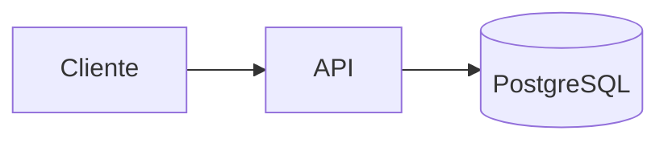

# API Node/NestJS + PostgreSQL

## Arquitectura



## Compose conceptual

```yaml
services:
  api:
    image: nexus.oscar.home/demo/api:${APP_VERSION}
    environment:
      DATABASE_URL: postgresql://app:${DB_PASSWORD}@db:5432/app
    depends_on:
      db:
        condition: service_healthy

  db:
    image: postgres:${POSTGRES_VERSION}
    environment:
      POSTGRES_DB: app
      POSTGRES_USER: app
      POSTGRES_PASSWORD: ${DB_PASSWORD}
    volumes:
      - pgdata:/var/lib/postgresql/data
    healthcheck:
      test: ["CMD-SHELL", "pg_isready -U app"]
      interval: 10s
      timeout: 5s
      retries: 5

volumes:
  pgdata:
```

## Lo importante

El volumen hace persistente la DB, pero **no es un backup**. Practicar:

```bash
pg_dump ... > backup.sql
```

y restaurar en una DB vacía.
