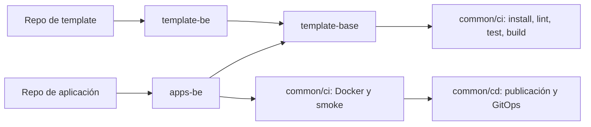

# Pipelines compartidos

O.S.C.A.R. usa [Forgejo Actions](../servicios/ci-runner.md) y el repositorio [ci-shared](http://git.oscar.home/mdelgado/ci-shared). La estructura v2 sigue la referencia `Arquitectura/pipelines/npm`: steps independientes, una plantilla general y dos plantillas consumidoras, para templates y para apps.



## Estructura y responsabilidades

- `common/ci/*` y `common/cd/*`: composite actions independientes; shell verificable en `scripts/ci` y `scripts/cd`.
- `template-base.yml`: instalación npm/Yarn, lint, tests y build. Todos los comandos y el registro npm son configurables.
- `template-be.yml`: valida templates mediante la base común, sin publicar imágenes ni desplegar.
- `apps-be.yml`: usa la misma base y agrega build Docker, smoke test opcional, publicación y GitOps.
- Repos de aplicaciones: comandos, parámetros y verificaciones propias. El smoke test vive en `scripts/ci-smoke.sh` de cada app.

Forgejo exige los workflows en `.forgejo/workflows/`; los nombres equivalen a las carpetas `template-base`, `template-be` y `apps-be` de la referencia GitLab. No se copian sus integraciones con Sonar, notificaciones o rebase, que no forman parte del pipeline actual de O.S.C.A.R.

`nestjs-starter` sigue siendo un mirror de solo lectura del proyecto de GitHub. El CI de `ci-shared` prueba la cadena `template-be → template-base → steps`; hay un ejemplo listo para futuros templates editables en `examples/template-consumer.yml`.

## Consumidor real: ci-demo

```yaml
name: CI/CD
'on':
  push:
    branches:
      - main
  pull_request: {}
  workflow_dispatch: {}
concurrency:
  group: ci-${{ github.ref }}
  cancel-in-progress: false
jobs:
  pipeline:
    uses: mdelgado/ci-shared/.forgejo/workflows/apps-be.yml@v2.0.0
    with:
      node-version: '20'
      package-manager: npm
      install-command: npm install
      lint-command: npm run lint
      test-command: npm test
      build-command: ''
      nexus-npm-url: ''
      image: 192.168.0.151:8082/ci-demo
      app: ci-demo
      publish: ${{ github.ref == 'refs/heads/main' && github.event_name == 'push' && 'true' || 'false' }}
      deploy: ${{ github.ref == 'refs/heads/main' && github.event_name == 'push' && 'true' || 'false' }}
    secrets:
      nexus-user: ${{ secrets.NEXUS_USER }}
      nexus-password: ${{ secrets.NEXUS_PASSWORD }}
      gitops-token: ${{ secrets.GITOPS_TOKEN }}
```

`ci-demo` usa npm y Node 20; los consumidores NestJS usan Yarn y Node 22. Los comandos diferentes no requieren duplicar la infraestructura del pipeline. `led-controller` conserva además verificación posterior y rollback propios, con `DEPLOY: 'false'`.

En PRs y ejecuciones manuales, `publish` y `deploy` son `'false'`: la imagen se construye y prueba sin tocar Nexus ni GitOps. En un push a `main`, las aplicaciones mantienen su política de publicación y despliegue. Los smoke tests usan `SMOKE_CONTAINER` único y el wrapper lo elimina aunque falle la prueba. Los builds de validación no sobrescriben el alias local `latest`.

## Versionado

Los consumidores fijan `@v2.0.0`, nunca `@main`. Para actualizar: preparar una candidata inmutable, probarla con consumidores, publicar el tag estable compartido y después cambiar cada consumidor. `node scripts/version.mjs vX.Y.Z` actualiza coherentemente las referencias internas de `ci-shared`.

v2 cambia el contrato: las aplicaciones que consumían `template-be` deben pasar a `apps-be`, y los steps pasan de `actions/` a `common/`. Los tags v1 permanecen intactos.

## Credenciales y GitOps

Los secretos `NEXUS_USER`, `NEXUS_PASSWORD` y `GITOPS_TOKEN` se pasan por `jobs.<job>.secrets`, desde los [secrets de Forgejo](../servicios/forgejo.md#secrets-y-variables-de-actions-nivel-usuario-no-solo-por-repo). Forgejo 16 no admite declararlos dentro de `on.workflow_call.secrets`. La configuración temporal de Docker se elimina al terminar el push.

El step de GitOps modifica solo `apps/<app>/values.yaml` y publica el tag del commit. Argo CD reconcilia el despliegue; el runner no recibe credenciales de Kubernetes. El job condicional de deploy invoca directamente la composite action: evita un fallo observado de Forgejo al anidar otro reusable workflow bajo `if: inputs.*`.

El runner usa el socket Docker del host (`docker_host: automount`) y el registry HTTP de Nexus. Las composite actions se descargan con URL completa por IP porque el contenedor del runner no resuelve `git.oscar.home`. Ver [incidencias y validación](./revision-pipelines-2026-09-28.md).
