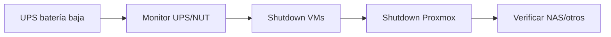

# Energía y refrigeración

## Objetivos

- evitar apagados abruptos;
- conocer autonomía real;
- evitar puntos calientes;
- poder apagar cargas no críticas antes que las críticas.

## UPS

La UPS debe alimentar, prioritariamente:

1. ONT;
2. firewall/router;
3. switch;
4. host Proxmox;
5. almacenamiento necesario para shutdown limpio.

Pantallas decorativas o cargas prescindibles pueden quedar fuera si reducen demasiado la autonomía.

## Shutdown ordenado

Objetivo futuro:

## Temperatura

Registrar al menos:

- CPU del Dell;
- temperatura de SSD/NVMe si está disponible;
- temperatura interna del rack;
- temperatura ambiente.

La observación vale más que una regla fija: registrar baseline en reposo y bajo carga, y alertar por desviaciones.
