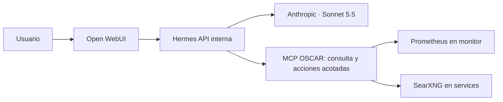

# Hermes Agent

**Estado al 2026-10-08: piloto desplegado y capa operadora mergeada a `main` de GitOps (13 PRs, ramas `codex/hermes-*`).** Anthropic `claude-sonnet-5-5`,
secretos aislados en Infisical, login e inferencia real verificados desde Open WebUI, y las tres
herramientas MCP de consulta comprobadas contra Prometheus y SearXNG. WebUI responde en `http://ai.oscar.home`;
no hay exposición por Cloudflare ni registro público. Decisión de producto confirmada por el usuario
(2026-10-07): Hermes ejecuta acciones reales directo, sin paso de aprobación humana intermedio — ver
[Operación extendida](#operación-extendida-docker-compose-forgejo-argo-cd-lxc--2026-10-08) para el detalle
de qué puede hacer hoy y los hallazgos de la revisión de seguridad.

Las PR [#1](http://git.oscar.home/mdelgado/gitops/pulls/1) (piloto),
[#2](http://git.oscar.home/mdelgado/gitops/pulls/2) (Ingress LAN) y
[#3](http://git.oscar.home/mdelgado/gitops/pulls/3) (probe Prometheus) están fusionadas.

Hermes está conectado a Discord. El candidato agrega acciones API concretas sobre Proxmox
y Kubernetes: listar y operar VMs, clonar desde la plantilla aprobada y reiniciar Deployments o
StatefulSets. El token Proxmox dedicado ya está en Infisical y validado contra la API. El candidato
local contiene las herramientas y pruebas; falta sincronizarlo desde GitOps para activarlo en Discord.

El gateway nativo de Discord está activo con bot dedicado e ID de usuario autorizado en Infisical.
Hermes requiere mención y permite solo usuarios en allowlist.

## Arquitectura del piloto

El chart está en `infrastructure/hermes/`, desplegado desde `apps/hermes` del repositorio
Forgejo `gitops`. Usa el namespace `oscar-ai`, Services internos, persistencia `local-path`,
referencias de Infisical y políticas de red. El Ingress de WebUI usa Traefik en la LAN.

Versiones fijadas por digest: Hermes `v2026.9.24` y Open WebUI `v0.11.4-slim`.
El API de Hermes no se publica por Ingress ni por Cloudflare.

## Qué puede consultar

| Herramienta | Fuente | Límite |
|---|---|---|
| `oscar_get_status` | Prometheus `up`, `probe_success`, `monitor_status` | Solo targets que realmente tengan métricas; ausencia de datos no significa sano |
| `oscar_get_availability` | `probe_success`, ventanas 1 h, 24 h y 7 d | Porcentaje de muestras exitosas, cobertura desconocida; no calcula SLA ni downtime |
| `oscar_web_search` | SearXNG en `192.168.0.154:8080` | Hasta ocho resultados; contenido externo no confiable |

Herramientas del candidato, todavía no desplegadas: `oscar_list_vms`, `oscar_vm_power`,
`oscar_create_vm` (clon detenido de la plantilla 9000) y `oscar_restart_workload`. La identidad
Proxmox `hermes-operator@pve!oscar` fue validada contra la API y sus credenciales están en Infisical.

Las consultas no aceptan PromQL arbitrario ni destinos HTTP. Las acciones nuevas no reciben comandos
arbitrarios: usan endpoints fijos de Proxmox y Kubernetes. El candidato requiere un ServiceAccount
acotado a reinicios de workloads y un token Proxmox dedicado. No monta socket Docker ni directorios
de hosts. Las acciones no están disponibles en el despliegue hasta sincronizar la fuente GitOps.

## Operación extendida (Docker Compose, Forgejo, Argo CD, LXC) — 2026-10-08

Mergeado a `main` de `oscar-gitops-forgejo` vía 13 PRs (`codex/hermes-*`), sin pasar por el chart
local de `infrastructure/hermes/` en este repo (ese sigue siendo un candidato aparte, sin sincronizar).
`forgejo.enabled` y `dockerOperator.enabled` quedan en `true` por defecto en `values.yaml`.

**Qué agrega:**

- `oscar_vm_power` ahora cubre LXC además de VMs QEMU.
- `oscar_list_workloads`/`oscar_scale_workload`: escala cualquier Deployment/StatefulSet entre 0 y 10
  réplicas, en cualquier namespace salvo `kube-system`/`argocd`/`infisical-operator-system` (verificar
  que este último nombre coincide con el namespace real del operador de Infisical — la protección es
  un `if` en Python, no RBAC, así que un nombre mal escrito no protege nada).
- `oscar_argocd_list_applications`/`oscar_argocd_sync_application`: fuerza un sync de una Application
  (sin prune). RBAC correctamente acotado: `Role` namespaced en `argocd`, no `ClusterRole`.
- `oscar_forgejo_*`: lista repos/PRs, lee archivos, crea rama y commitea un archivo, abre PR — en los
  10 repos de OSCAR (`nestjs-starter` queda de solo lectura). **Es la única pieza con revisión humana
  real incorporada**: los commits solo pueden ir a ramas `hermes/*` (nunca a la rama por defecto), un
  archivo por commit, con tope de tamaño, y no existe ninguna herramienta para mergear el PR — Hermes
  propone, un humano decide. Si en algún momento se quiere un término medio para las otras
  herramientas, este es el patrón a copiar.
- **Operador de Docker Compose**: servicio HTTPS nuevo (`docker_operator.py`, systemd) corriendo en
  5 hosts (`core`, `devops`, `automation`, `monitor`, `network`). Hermes puede `start`/`stop`/
  `restart`/`up` sobre los proyectos Compose allowlisteados por host — en `core` incluye
  **Infisical, Forgejo, cloudflared y n8n**, sin distinguir dentro de la allowlist qué proyecto es
  crítico. Ingeniería del operador en sí prolija: token de 48 bytes por host en Infisical, comparación
  con `hmac.compare_digest`, TLS con CA/certificado dedicado por host, systemd con `ProtectSystem=strict`,
  `NoNewPrivileges`, `ReadOnlyPaths`, `PrivateTmp`.

**Decisión del usuario (2026-10-07), ya registrada en memoria:** ninguna de estas herramientas lleva
paso de aprobación — es el diseño vigente, no un hallazgo a corregir. Lo que sigue siendo válido
señalar son los hallazgos de **alcance** (allowlist de VMs/proyectos, el nombre del namespace protegido,
y que el operador de Docker no distingue "bajo riesgo" de "crítico" dentro de un mismo host) para quien
quiera acotarlos sin tocar el principio de "que haga todo lo que se le pide".

**Housekeeping pendiente, no de seguridad:** `apps/hermes/files/__pycache__/*.pyc` y un `.pyc` de test
quedaron commiteados — deberían ir al `.gitignore`, no son un riesgo pero ensucian el repo.

## Estado real comprobado

- Argo CD `hermes` figura `Healthy` pero `OutOfSync`; los pods desplegados siguen con la configuración anterior.
- El token operador de Proxmox y la CA pública están en Infisical; una consulta de inventario validó
  credenciales, permisos y TLS. Las herramientas siguen desactivadas en el clúster hasta sincronizar GitOps.
- `k3s01`: 4 GiB nominales; tras la prueba marcó 2652 MiB usados (67%). Hermes usó ~452 MiB y
  WebUI ~304 MiB. Mantenerlo en observación bajo uso concurrente; no ampliar recursos todavía.
- SearXNG en Docker responde búsquedas JSON; el endpoint Kubernetes del spec histórico ya no aplica.
- n8n, worker, Redis y PostgreSQL Running.
- Prometheus ofrece 19 series `up` y ahora 11 `probe_success`; `monitor_status` sigue sin datos.
- `oscar_get_status` reportó datos para `up` y `probe_success`; `monitor_status` como `no_data`.
  `oscar_get_availability` devolvió cobertura `unknown`; búsqueda SearXNG devolvió 8 resultados.
- Una inferencia desde WebUI pidió a Hermes usar estado y búsqueda MCP; respondió con esos datos.

## Pendientes antes de declarar producción

1. Completado: proveedor/modelo; una inferencia real respondió correctamente.
2. Completado: proyecto Infisical **Hermes** con los cuatro secretos en `prod` y en la raíz `/`.
   La identidad `hermes-runtime` tiene rol Viewer solo en este proyecto. Se verificó lectura correcta
   de los cuatro secretos y rechazo 403 al proyecto **OSCAR Apps**; se retiraron los originales
   de `/hermes` después de comparar los valores migrados.
3. Monitor Prometheus Blackbox agregado: `probe_success{instance="http://ai.oscar.home/health"}` = 1.
4. Backup/restore: se generó un backup de VM 103 posterior al despliegue y se restauró como VM
   aislada. Se verificaron ambos PVC y el SHA-256 de `config.yaml` de Hermes coincidió. Esto prueba
   recuperación de los datos persistentes; falta probar recuperación integral del servicio y falta
   una copia cifrada fuera del host.
5. Seguir el uso de memoria con carga normal; el snapshot actual mostró 67% de uso en `k3s01`.

La prueba de Claude Code previa vive en `hermes-poc` y no forma parte de este chart.

## Validación del candidato

El 2026-10-05 pasaron siete pruebas unitarias, `helm lint`, render de Helm, validación
`kubectl apply --dry-run=server` y compilación de documentación.
Hermes arrancó como UID 10000, filesystem raíz de solo lectura y sin capacidades Linux:
MCP expuso las tres herramientas y consultó fuentes reales; `/health` y `/v1/models` devolvieron 200.
No se solicitó inferencia: esos endpoints no prueban la validez de una credencial del proveedor.

WebUI arrancó en un pod temporal en `k3s01`, como UID 1000, con credenciales generadas solo
para la prueba: health 200, login de administrador 200 y signup bloqueado con 403.
Se corrigió `STATIC_DIR` para permitir el arranque sin root. La misma imagen no arranca en
la CPU virtual actual de `devops` por falta de X86_V2, lo que confirma la necesidad de mantener
el destino en un nodo compatible. Los recursos temporales se retiran después de la validación.
En el despliegue real, el login y la inferencia WebUI → Hermes → Anthropic pasaron; las tres
herramientas MCP consultaron sus upstreams dentro del pod con NetworkPolicies aplicadas.

## Operación

Las actualizaciones se realizan cambiando la imagen en GitOps, no desde la interfaz de Hermes.
Un rollback de imagen no garantiza compatibilidad de las bases: conservar backup previo y probar restore.
Los PVC tienen protección contra prune/delete de Argo CD; detener el piloto debe conservar esos datos.
El backup confirmado es una copia snapshot de VM de Proxmox en el storage `Backups`; el 2026-10-05
se restauró la VM en un clon sin red y se verificaron los dos PVC y el hash de la configuración de
Hermes. No se arrancó Kubernetes en el clon para evitar identidad/IP duplicada. Esto prueba la
recuperación de los datos persistentes, pero no el arranque integral del servicio. El storage está
en el mismo host y no ofrece copia off-site independiente ni cifrado de aplicación.
Tratar el PVC de Hermes como sensible: el runtime puede persistir credenciales en su pool
además de leerlas del entorno. Los backups deben quedar cifrados y con acceso restringido.

Documentación oficial: [Hermes y Open WebUI](https://hermes-agent.nousresearch.com/docs/user-guide/messaging/open-webui),
[MCP en Hermes](https://hermes-agent.nousresearch.com/docs/user-guide/features/mcp).
