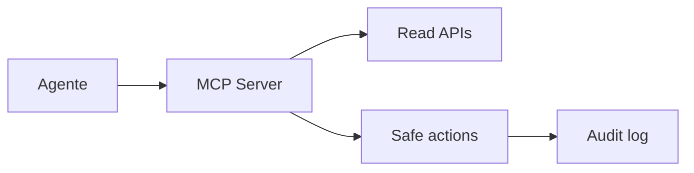

# MCP / Tooling

El agente necesita herramientas de dominio en vez de una shell root genérica.

## Ejemplos de herramientas deseables

```text
get_host_health(host)
list_vms()
get_vm_status(vm_id)
restart_lab_container(name)
query_prometheus(query)
search_logs(service, since)
get_backup_status()
create_gitops_pr(change)
```

Cada herramienta tiene permisos más fáciles de razonar que `ssh root@pve01`.

## Patrón



## Regla

Si una herramienta puede destruir datos, debe existir un runbook humano equivalente y una forma clara de confirmar objetivo y alcance.
