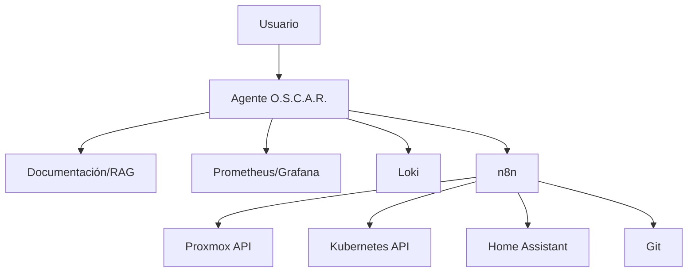

# Capa de IA

La IA de O.S.C.A.R. no es un chatbot decorativo. La meta es que pueda **leer contexto operativo, explicar, proponer y ejecutar acciones acotadas**.

## Niveles de autonomía

### Nivel 0 · Consulta

“¿Qué corre en core01?”

Solo lectura sobre inventario/documentación.

### Nivel 1 · Diagnóstico

“¿Por qué Grafana está lento?”

Consulta métricas/logs y propone hipótesis.

### Nivel 2 · Acción segura

“Reiniciá el contenedor demo-api.”

Ejecuta una acción permitida, auditada y reversible.

### Nivel 3 · Workflow condicionado

“Si el backup falla, intentá una vez y avisame.”

Automatización con límites explícitos.

### Nivel 4 · Administración sensible

Cambios de firewall, destrucción de VM, rotación masiva de secretos: requieren confirmación fuerte y controles adicionales. No se habilitan por defecto.
