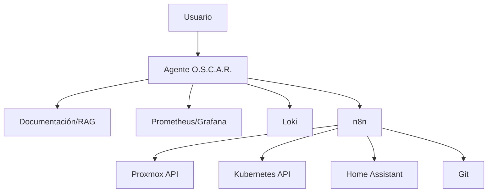
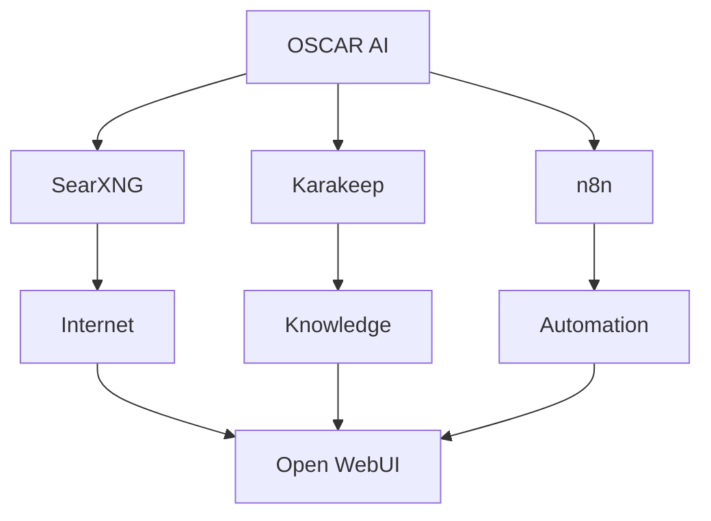

# Capa de IA

La IA de O.S.C.A.R. no es un chatbot decorativo. La meta es que pueda **leer contexto operativo, explicar, proponer y ejecutar acciones acotadas**.

## OSCAR AI — SearXNG + Karakeep + n8n → Open WebUI (candidato de arquitectura)

Idea de arquitectura (2026-09-17, todavía candidato — no una decisión tomada) que surge de combinar tres piezas ya aprobadas o candidatas por separado, no pensadas originalmente como un conjunto: [SearXNG](../servicios/catalogo.md) (Fase 8, búsqueda privada), `Karakeep` (candidata ascendida, ver [catálogo de servicios](../servicios/catalogo.md#karakeep--candidata-ascendida-con-una-dirección-de-arquitectura-real-2026-09-17) — bookmarking con full-text + búsqueda semántica, OCR, etiquetado/resumen con LLM) y [n8n](../servicios/n8n.md) (ya desplegado). Las tres alimentando a [Open WebUI](../servicios/catalogo.md) (Fase 8) como front-end único:

Lo que hace esto interesante frente a sumar Karakeep como un bookmarking manager suelto: Karakeep ya trae OCR + resumen/etiquetado vía LLM + búsqueda semántica de fábrica — es decir, ya es "agent-friendly" sin adaptarlo, encaja directo como la pieza de "memoria/conocimiento" que hoy no existe en ningún lado de O.S.C.A.R. (SearXNG cubre "buscar en Internet", n8n cubre "ejecutar workflows", pero nada cubre "recordar/indexar lo que ya se encontró o guardó"). No cambia el estado de aprobación de Karakeep (sigue en evaluación, ver [catálogo](../servicios/catalogo.md#candidatos-evaluados-no-decididos-todavía)) — es la razón por la que subió de prioridad frente a Docuseal/Nextcloud/Paperless-ngx/Firefly III, no una implementación decidida.

## Niveles de autonomía

### Nivel 0 · Consulta

“¿Qué corre en core01?”

Solo lectura sobre inventario/documentación.

### Nivel 1 · Diagnóstico

“¿Por qué Grafana está lento?”

Consulta métricas/logs y propone hipótesis.

### Nivel 2 · Acción segura

“Reiniciá el contenedor demo-api.”

Ejecuta una acción permitida, auditada y reversible.

### Nivel 3 · Workflow condicionado

“Si el backup falla, intentá una vez y avisame.”

Automatización con límites explícitos.

### Nivel 4 · Administración sensible

Cambios de firewall, destrucción de VM, rotación masiva de secretos: requieren confirmación fuerte y controles adicionales. No se habilitan por defecto.
