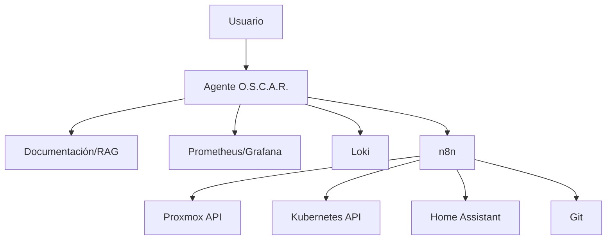

# Capa de IA

La IA de O.S.C.A.R. no es un chatbot decorativo. La meta es que pueda **leer contexto operativo, explicar, proponer y ejecutar acciones acotadas**.



## OSCAR AI — capacidades, no el recorrido técnico de una request (candidato de arquitectura)

Arquitectura candidata (2026-09-17, refinada — todavía candidata, no una decisión tomada) para lo que puede llegar a ser "OSCAR AI": describe **qué puede hacer**, no el camino que sigue una request puntual. Combina piezas ya aprobadas ([SearXNG](../servicios/catalogo.md) y [Open WebUI](../servicios/catalogo.md), Fase 8), una ya desplegada ([n8n](../servicios/n8n.md)) y una candidata ascendida (`Karakeep`, ver [catálogo de servicios](../servicios/catalogo.md#karakeep--candidata-ascendida-con-una-dirección-de-arquitectura-real-2026-09-17)):

<iframe src="/diagrams/oscar-ai-architecture.html" style={{width: '100%', height: '680px', border: '1px solid var(--ifm-color-emphasis-300)', borderRadius: '8px'}} title="Diagrama de arquitectura OSCAR AI"></iframe>

Interactivo (pan/zoom, tema claro/oscuro, trazado de relaciones) — [abrirlo en pantalla completa →](pathname:///diagrams/oscar-ai-architecture.html). Generado a partir de `static/diagrams/src/oscar-ai.architecture.json`, validado (`showcase`, 9/9 checks, 0 errores).

Roles:

```text
Open WebUI = interfaz
LLM APIs   = razonamiento
SearXNG    = búsqueda externa
Karakeep   = conocimiento guardado
n8n        = acciones / herramientas
HAOS       = hogar / IoT
```

Lo que hace a Karakeep interesante frente a sumarlo como un bookmarking manager suelto: ya trae OCR + resumen/etiquetado vía LLM + búsqueda semántica de fábrica — es decir, ya es "agent-friendly" sin adaptarlo, encaja directo como la pieza de "memoria/conocimiento" que hoy no existe en ningún lado de O.S.C.A.R. (SearXNG cubre "buscar en Internet", n8n cubre "ejecutar workflows", pero nada cubre "recordar/indexar lo que ya se encontró o guardó").

**Salvedad, importante:** esto es arquitectura conceptual — `Karakeep` **sigue sin estar aprobado para instalar** (ver [catálogo](../servicios/catalogo.md#candidatos-evaluados-no-decididos-todavía)), participa del diagrama sin que eso implique desplegarlo ahora. Es la razón por la que subió de prioridad frente a Docuseal/Nextcloud/Paperless-ngx/Firefly III, no una implementación decidida.

Esta sección es la fuente de verdad de la arquitectura de OSCAR AI — `OSCAR_FINAL_INFRASTRUCTURE.md` (raíz del repo) la referencia, no la duplica con criterio propio.

## Niveles de autonomía

### Nivel 0 · Consulta

“¿Qué corre en core01?”

Solo lectura sobre inventario/documentación.

### Nivel 1 · Diagnóstico

“¿Por qué Grafana está lento?”

Consulta métricas/logs y propone hipótesis.

### Nivel 2 · Acción segura

“Reiniciá el contenedor demo-api.”

Ejecuta una acción permitida, auditada y reversible.

### Nivel 3 · Workflow condicionado

“Si el backup falla, intentá una vez y avisame.”

Automatización con límites explícitos.

### Nivel 4 · Administración sensible

Cambios de firewall, destrucción de VM, rotación masiva de secretos: requieren confirmación fuerte y controles adicionales. No se habilitan por defecto.
