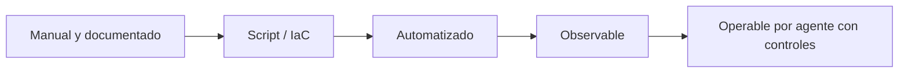

# O.S.C.A.R. HomeLab

**Operations, Services, Compute, Automation & Routing.**

O.S.C.A.R. es un laboratorio doméstico pensado como una **plataforma de infraestructura**, no solamente como una computadora que ejecuta contenedores. El objetivo es disponer de un entorno propio para aprender, experimentar, automatizar y operar servicios reales usando tecnologías de virtualización, networking, contenedores, Kubernetes, GitOps, observabilidad, seguridad e inteligencia artificial.

Esta documentación está escrita para que el entorno pueda construirse desde cero y para que, meses después, siga siendo posible responder preguntas como:

- ¿qué corre en cada equipo?
- ¿qué servicios son críticos y cuáles son laboratorios?
- ¿qué dependencia tiene un servicio antes de instalarlo?
- ¿cómo se respalda y cómo se restaura?
- ¿cómo se actualiza sin romper el resto?
- ¿qué puertos y redes utiliza?
- ¿qué hago si un nodo, disco, contenedor o enlace deja de responder?
- ¿qué puedo desplegar para aprender una tecnología concreta?

## Cómo leer la guía

La documentación usa tres estados conceptuales:

| Estado | Significado |
|---|---|
| **Actual** | Hardware o servicio que ya forma parte de O.S.C.A.R. |
| **Objetivo** | Componente que forma parte de la arquitectura deseada pero todavía puede estar pendiente de implementación. |
| **Laboratorio** | Tecnología o prueba deliberadamente opcional que no debe transformarse en una dependencia crítica. |

La mayoría de esta guía describe **Objetivo** con el mismo nivel de detalle que si ya existiera — es deliberado (ver [por qué](./arquitectura/estado-actual.md#por-qué-esta-página-existe)), pero significa que hay que revisar [estado actual](./arquitectura/estado-actual.md) para saber qué de todo esto está realmente instalado hoy.

:::tip ¿Primera vez con Linux/terminal?
Esta guía da el comando completo en cada paso, no solo la idea — no hace falta saber Linux de antes. Si nunca usaste una terminal o SSH, arrancá por [herramientas básicas](./primeros-pasos/herramientas-basicas.md) antes de tocar el hardware.
:::

:::important
Nunca tomes un bloque marcado como **ejemplo** y lo copies sin revisar direcciones IP, nombres, contraseñas, discos, interfaces o rutas. Los ejemplos muestran el patrón; el inventario de O.S.C.A.R. es la fuente de verdad.
:::

:::note El hardware de esta guía es el mío, no una receta
El Dell OptiPlex, las Raspberry Pi, el rack GeeekPi, el DVR Dahua, etc. son **mi** inventario real ([hardware.yaml](../inventory/hardware.yaml)), no una lista de compras recomendada. Si estás construyendo tu propio O.S.C.A.R. con otro hardware, usá [requisitos mínimos](./referencia/requisitos-minimos.md) para dimensionar el tuyo — ahí está separado qué necesita cada componente de la arquitectura de qué SKU específico tengo yo. Algunas piezas de mi inventario (el DVR es el ejemplo más claro) están en el rack simplemente porque ya las tenía y prefiero no dejarlas sueltas, no porque CCTV sea un requisito de un homelab.
:::

## Objetivos técnicos

O.S.C.A.R. debe permitir, progresivamente:

1. Virtualizar servidores con Proxmox.
2. Separar cargas por función y criticidad.
3. Ejecutar workloads con Docker y Docker Compose.
4. Disponer de un cluster k3s para aprender Kubernetes.
5. Administrar despliegues mediante GitOps con Argo CD.
6. Hospedar repositorios, artefactos y runners de CI/CD.
7. Observar CPU, memoria, disco, temperatura, red, servicios y disponibilidad.
8. Centralizar logs y alertas.
9. Automatizar tareas mediante n8n.
10. Ejecutar servicios domésticos como DNS, Home Assistant y CCTV.
11. Mantener backups verificables y procedimientos de restore.
12. Añadir una capa de IA que pueda consultar el estado del laboratorio y ejecutar acciones controladas.

## Regla de oro

> Primero hacemos que algo sea **reproducible**. Después hacemos que sea **automático**. Recién entonces dejamos que un agente de IA pueda operarlo.

Eso significa que una tarea debe tener, idealmente, este recorrido:

## Orden recomendado

No conviene instalar todos los servicios de la guía durante el primer fin de semana. El orden base es:

1. inventario y rack;
2. red y direccionamiento;
3. Proxmox;
4. almacenamiento;
5. servicios fundamentales;
6. backup y observabilidad;
7. Docker y plataforma de aplicaciones;
8. Kubernetes/GitOps;
9. automatización;
10. servicios del hogar;
11. capa de IA.

El [roadmap](./roadmap/roadmap-general.md) convierte este orden en fases con criterios de salida.
