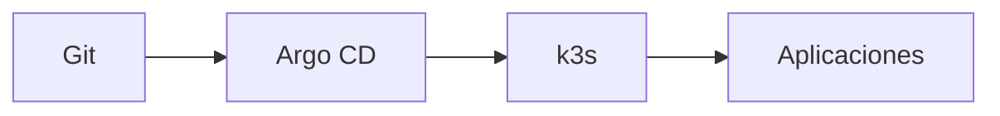

# Bootstrap de Argo CD

## Flujo objetivo



## Repo real

`http://git.oscar.home/mdelgado/oscar-gitops.git` — Forgejo, origen real desde [ADR-012](../arquitectura/decisiones-arquitectonicas.md#adr-012--forgejo-como-mirror-de-solo-lectura-de-oscar-gitops-no-origen) (arrancó como mirror de `github.com/rudemex/oscar-gitops` con deploy key SSH; hoy Argo CD lee de Forgejo vía credencial HTTP, ver [instalación de Argo CD](./instalacion-argocd.md)). GitHub queda como copia secundaria, actualizada a mano:

```text
oscar-gitops/
├── apps/
│   ├── oscar-led-controller/      # primer servicio migrado (ver docs/servicios)
│   │   ├── application.yaml       # Application de Argo CD — un solo source
│   │   ├── Chart.yaml             # chart Helm real y autocontenido de este servicio
│   │   ├── values.yaml            # toda la config de este servicio
│   │   └── templates/
│   │       ├── deployment.yaml
│   │       ├── service.yaml
│   │       └── ingress.yaml       # Traefik, host *.oscar.home
│   └── ci-demo/                   # cierra el loop CI→registry→GitOps→deploy
│       ├── application.yaml       # syncPolicy.automated (selfHeal + prune) — a diferencia de root-app
│       ├── Chart.yaml
│       ├── values.yaml            # image.tag lo pisa la CI en cada push, no se edita a mano
│       └── templates/
│           ├── deployment.yaml    # imagePullSecrets: nexus-pull (Secret creado a mano, no vive en Git)
│           ├── service.yaml
│           └── ingress.yaml
├── clusters/
│   └── oscar/
│       ├── root-app.yaml               # app-of-apps, único Application aplicado a mano, sync manual a propósito
│       └── argocd-server-ingress.yaml  # Ingress de la propia UI de Argo CD
└── README.md
```

Mismo patrón que el template Helm de backend NestJS que ya se usa fuera de
este proyecto (`Chart.yaml` + `values.yaml` + `templates/*.yaml`, un chart
por servicio) — sin HPA/OTel (no aplican a un cluster de un solo nodo sin
ese stack). Ambos servicios reales sí tienen `Ingress` (Traefik, resuelto
por el wildcard DNS `*.oscar.home` en AdGuard — ver
[DNS con AdGuard](../red/dns-adguard.md)). Cada template referencia
`.Chart.Name`/`.Values.*` en vez de repetir texto a mano. Abrir la carpeta
de un servicio alcanza para entender qué corre, sin cruzar con otra parte
del repo — la contrapartida es que agregar un servicio nuevo implica copiar
los `templates/*.yaml` (no hay una librería compartida); revisitar esa
decisión si la duplicación entre servicios empieza a doler de verdad.
`root-app.yaml` sincroniza `apps/**/application.yaml` (`directory.recurse:
true` + `include: "*/application.yaml"`) — agregar un servicio nuevo es
copiar la carpeta de `ci-demo` como base (ya incluye Ingress e
imagePullSecrets), ajustar `Chart.yaml`/`values.yaml` y hacer commit, sin
volver a tocar Argo CD a mano — salvo sincronizar `root-app` manualmente
para que levante la Application nueva. Ningún servicio define Secrets
*en Git* todavía (`nexus-pull` se creó a mano con `kubectl create secret
docker-registry`, solo se referencia por nombre desde el chart) — esa
decisión de gestión de secrets vía Git sigue pendiente (SOPS+age vs Sealed
Secrets, ver [gestión de secretos](../seguridad/secretos.md)).

## Bootstrap manual permitido

Argo CD tiene un problema inevitable de bootstrap: algo debe instalarlo la primera vez. Ese paso manual/scriptado se documenta y, desde entonces, la mayor cantidad posible de configuración se mueve a Git.

## Reglas

- no guardar kubeconfig/tokens en Git;
- evitar auto-sync destructivo en primeras pruebas;
- entender pruning antes de habilitarlo;
- revisar diffs antes de cambiar CRDs o storage;
- tener un camino de acceso si el Ingress falla.
