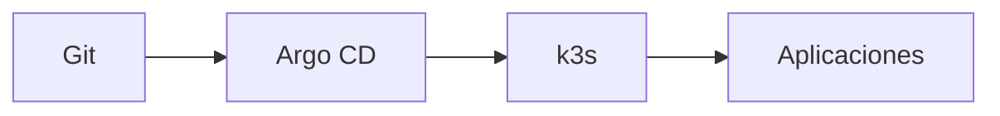

# Bootstrap de Argo CD

## Flujo objetivo



## Repo real

`github.com/rudemex/oscar-gitops` (privado; Argo CD accede vía deploy key SSH de solo lectura, ver [instalación de Argo CD](./instalacion-argocd.md)):

```text
oscar-gitops/
├── apps/
│   └── oscar-led-controller/      # primer servicio migrado (ver docs/servicios)
│       ├── application.yaml       # Application de Argo CD — un solo source
│       ├── Chart.yaml             # chart Helm real y autocontenido de este servicio
│       ├── values.yaml            # toda la config de este servicio
│       └── templates/
│           ├── deployment.yaml
│           ├── service.yaml
│           ├── config-map.yaml
│           └── pvc.yaml           # solo si el servicio necesita persistencia
├── clusters/
│   └── oscar/
│       └── root-app.yaml          # app-of-apps, único Application aplicado a mano
└── README.md
```

Mismo patrón que el template Helm de backend NestJS que ya se usa fuera de
este proyecto (`Chart.yaml` + `values.yaml` + `templates/*.yaml`, un chart
por servicio) — sin Ingress/HPA/OTel (no aplican a un cluster de un solo
nodo sin ese stack) y sin secrets (ver más abajo). Cada template referencia
`.Chart.Name`/`.Values.*` en vez de repetir texto a mano. Abrir la carpeta
de un servicio alcanza para entender qué corre, sin cruzar con otra parte
del repo — la contrapartida es que agregar un servicio nuevo implica copiar
los `templates/*.yaml` (no hay una librería compartida); revisitar esa
decisión si la duplicación entre servicios empieza a doler de verdad.
`root-app.yaml` sincroniza `apps/**/application.yaml` (`directory.recurse:
true` + `include: "*/application.yaml"`) — agregar un servicio nuevo es
copiar la carpeta de `oscar-led-controller` como base, ajustar
`Chart.yaml`/`values.yaml` y hacer commit, sin volver a tocar Argo CD a
mano. Ningún servicio tiene secrets todavía — esa decisión sigue pendiente
(SOPS+age vs Sealed Secrets, ver [gestión de secretos](../seguridad/secretos.md)).

## Bootstrap manual permitido

Argo CD tiene un problema inevitable de bootstrap: algo debe instalarlo la primera vez. Ese paso manual/scriptado se documenta y, desde entonces, la mayor cantidad posible de configuración se mueve a Git.

## Reglas

- no guardar kubeconfig/tokens en Git;
- evitar auto-sync destructivo en primeras pruebas;
- entender pruning antes de habilitarlo;
- revisar diffs antes de cambiar CRDs o storage;
- tener un camino de acceso si el Ingress falla.
