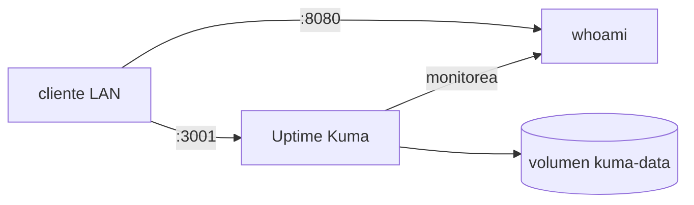

# Lab 02 · Docker Compose

**Tipo:** mixto. El contenedor `whoami` es un smoke test 100% descartable. Uptime Kuma, en cambio, es un servicio Objetivo real del catálogo ([uptime-kuma.md](../servicios/uptime-kuma.md)): si este lab se hace sobre `core01` real siguiendo la convención de [docker-host-baseline.md](../servicios/docker-host-baseline.md), lo que se despliega en el paso 2 **es** la instalación real de Uptime Kuma para Fase 3, no un experimento a destruir. Si en cambio se practica sobre una VM de laboratorio aislada, todo el stack —Kuma incluido— se destruye al final. La sección Cleanup cubre los dos casos.

## Objetivo

Levantar un stack de dos servicios (`whoami` + Uptime Kuma) con Docker Compose siguiendo la estructura de directorios estándar de O.S.C.A.R., reiniciar y recrear contenedores, y comprobar qué sobrevive a esa recreación y qué no. Al terminar hay que poder explicar, con evidencia y no de memoria, la diferencia entre imagen, contenedor, volumen, red y archivo Compose.

## Prerequisitos

- [Lab 01](./01-linux-ssh.md) completado, o una VM Linux equivalente con acceso SSH por clave.
- Docker Engine y Docker Compose instalados en el host ([crear-vm-core01.md](../proxmox/crear-vm-core01.md), sección Docker).
- Estructura `/srv/oscar/apps/` creada según [docker-host-baseline.md](../servicios/docker-host-baseline.md).

Recursos: el host reutiliza `core01` (2 vCPU/4 GB) o una VM de laboratorio equivalente a la del Lab 01; los dos contenedores en conjunto piden menos de 300 MB de RAM.

## Arquitectura



## Pasos

### 1. Estructura de directorios

```bash
sudo mkdir -p /srv/oscar/apps/lab02/{data}
cd /srv/oscar/apps/lab02
```

Si el objetivo es dejar Uptime Kuma como servicio real, usar en cambio `/srv/oscar/apps/uptime-kuma/` para ese servicio y `/srv/oscar/apps/lab02-whoami/` solo para el smoke test — no mezclar el estado real con el descartable en el mismo directorio.

### 2. `compose.yaml`

```yaml
services:
  whoami:
    image: traefik/whoami:v1.11.0
    restart: unless-stopped
    ports:
      - "8080:80"

  uptime-kuma:
    image: louislam/uptime-kuma:1
    restart: unless-stopped
    ports:
      - "3001:3001"
    volumes:
      - kuma-data:/app/data

volumes:
  kuma-data:
```

### 3. Levantar y verificar

```bash
docker compose up -d
docker compose ps
curl http://localhost:8080
```

### 4. Configurar el monitor en Uptime Kuma

Entrar a `http://<host>:3001`, completar el setup inicial y crear un monitor HTTP apuntando a `http://whoami:80` (nombre del servicio Compose, resoluble dentro de la red por defecto que Compose crea) o a `http://<host>:8080` desde afuera.

### 5. Provocar una falla controlada

```bash
docker stop lab02-whoami-1   # o el nombre real que muestre docker compose ps
```

Observar en Uptime Kuma cómo el monitor pasa a down y cuánto tarda en detectarlo (según el intervalo configurado).

### 6. Recuperar y comparar `restart` vs `recreate`

```bash
docker start lab02-whoami-1          # recupera el mismo contenedor
docker compose up -d --force-recreate whoami   # crea un contenedor nuevo desde la misma imagen
docker compose down                  # borra contenedores y red, conserva volúmenes
docker compose up -d                 # recrea todo; Kuma conserva sus monitores
docker compose down -v               # borra también el volumen kuma-data
docker compose up -d                 # Kuma arranca "de cero", sin monitores
```

## Validación

- `curl http://localhost:8080` devuelve el JSON de `whoami` con el hostname del contenedor.
- Tras `docker compose down` (sin `-v`) y `up -d`, Uptime Kuma sigue mostrando el mismo monitor configurado en el paso 4 — confirma que el estado vive en el volumen, no en el contenedor.
- Tras `docker compose down -v` y `up -d`, Uptime Kuma pide el setup inicial de nuevo — confirma que sin volumen no hay estado.
- `docker compose ps` muestra ambos servicios en estado `running`/`healthy` al final.

## Qué aprendimos

La imagen es la receta inmutable; el contenedor es una instancia efímera de esa receta; el volumen es lo único que sobrevive a `docker compose down`; la red la crea Compose automáticamente y permite que `uptime-kuma` le hable a `whoami` por nombre de servicio en vez de por IP. Este patrón —compose.yaml versionado en Git, `.env` fuera de Git, estado en un volumen con nombre— es exactamente el que sigue cada servicio real del catálogo (`n8n`, `nexus`, el stack de observabilidad), así que dominarlo acá con datos descartables evita improvisar la primera vez que importa de verdad.

## Cleanup

**Si se practicó en una VM de laboratorio aislada:**

```bash
docker compose down -v
rm -rf /srv/oscar/apps/lab02
```

**Si se practicó sobre `core01` real y Uptime Kuma queda como servicio Objetivo:**

```bash
# destruir solo el smoke test
docker compose stop whoami
docker compose rm -f whoami
rm -rf /srv/oscar/apps/lab02-whoami
```

Dejar Uptime Kuma corriendo bajo `/srv/oscar/apps/uptime-kuma/`, pero completar el resto del checklist de [uptime-kuma.md](../servicios/uptime-kuma.md) (backup de `kuma.db`, monitor externo independiente, etc.) antes de darlo por terminado — este lab solo cubre el despliegue inicial, no el checklist completo de servicio productivo.

## Troubleshooting

- **Puerto `8080` o `3001` "already in use"** → un lab anterior no se limpió, o el host ya corre otro servicio en ese puerto → `docker ps -a` para encontrar el contenedor ocupando el puerto, o remapear en `compose.yaml` (ej. `"8081:80"`).
- **Uptime Kuma pierde todos los monitores después de un `docker compose up -d`** → se usó `docker compose down -v` en algún momento anterior, que borra el volumen `kuma-data` → si era el servicio real, restaurar `kuma.db` desde el último backup; si era el lab, es el comportamiento esperado del paso 6.
- **`whoami` no es accesible desde otro cliente de la LAN aunque responde con `curl localhost` en el propio host** → el compose publica en `0.0.0.0` por defecto, así que normalmente no es esto; revisar primero un firewall de host (nftables, si se aplicó el hardening de [hardening-linux.md](../seguridad/hardening-linux.md)) bloqueando el puerto entrante.
