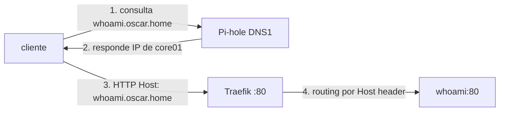

# Lab 03 · DNS y reverse proxy

**Tipo:** laboratorio opcional puro (descartable). El objetivo es entender el flujo DNS → proxy → app con una app de juguete; ni el registro DNS ni el proxy de este lab son la configuración definitiva de ningún servicio real.

## Objetivo

Crear un registro DNS interno en Pi-hole para el `whoami` del [Lab 02](./02-docker-compose.md) y publicarlo detrás de Traefik como reverse proxy interno, para poder acceder por nombre (`whoami.oscar.home`) en vez de recordar `IP:puerto`. TLS con la PKI interna queda **fuera de alcance**: es una decisión pendiente del [backlog](../roadmap/backlog.md), así que este lab documenta el flujo en HTTP simple y deja el hook de TLS para cuando exista una PKI real.

## Prerequisitos

- [Lab 02](./02-docker-compose.md) completado: `whoami` corriendo en Docker Compose.
- Pi-hole desplegado como resolver DNS interno ([dns-pihole.md](../red/dns-pihole.md)). Si todavía no existe, se puede sustituir temporalmente por una entrada en el `/etc/hosts` del cliente de prueba — dejar anotado en la evidencia del lab que es un sustituto, no la solución real.
- Recursos: Traefik agrega ~0.2 vCPU / 128 MB sobre el host que ya corre `whoami`.

## Arquitectura



Cuatro pasos, dos capas distintas: la resolución de nombre (1-2) no sabe nada de rutas HTTP; el proxy (3-4) no sabe nada de DNS. Confundir las dos capas es la fuente más común de "no anda" en este lab.

## Pasos

### 1. Registro DNS en Pi-hole

En Pi-hole → Local DNS → DNS Records, crear `whoami.oscar.home` apuntando a la IP del host que corre `whoami` (`core01` o la VM del Lab 02). Validar antes de tocar el proxy:

```bash
nslookup whoami.oscar.home <IP_DNS1>
```

### 2. Agregar Traefik al stack del Lab 02

Extender el `compose.yaml` del Lab 02 (o crear uno nuevo en `/srv/oscar/apps/lab03/`):

```yaml
services:
  traefik:
    image: traefik:v3.1
    restart: unless-stopped
    command:
      - --providers.docker=true
      - --providers.docker.exposedbydefault=false
      - --entrypoints.web.address=:80
    ports:
      - "80:80"
    volumes:
      - /var/run/docker.sock:/var/run/docker.sock:ro

  whoami:
    image: traefik/whoami:v1.11.0
    restart: unless-stopped
    labels:
      - traefik.enable=true
      - traefik.http.routers.whoami.rule=Host(`whoami.oscar.home`)
      - traefik.http.routers.whoami.entrypoints=web
```

Traefik necesita el socket de Docker para descubrir contenedores por label — es una excepción puntual a la regla general de no montar `/var/run/docker.sock` (ver [docker-compose.md](../servicios/docker-compose.md), sección Seguridad); se acepta acá porque Traefik es un componente de routing de confianza y el mount es de solo lectura.

Si `whoami` ya está corriendo desde el Lab 02 con `ports: ["8080:80"]`, quitar ese mapping: ahora el único camino de entrada debe ser Traefik.

### 3. Levantar

```bash
docker compose up -d
docker compose logs traefik | grep whoami
```

### 4. Provocar la falla y recuperar

```bash
docker compose stop whoami
curl -i http://whoami.oscar.home   # debe devolver 502/503
docker compose start whoami
curl -i http://whoami.oscar.home   # vuelve a 200
```

## Validación

```bash
dig +short whoami.oscar.home @<IP_DNS1>
curl http://whoami.oscar.home
```

`dig` debe devolver la IP del host correcto, y `curl` debe devolver el cuerpo de `whoami` (hostname, IP, headers) sin especificar puerto — la prueba de que las dos capas (DNS y proxy) están funcionando juntas. `docker compose logs traefik` debe mostrar el router `whoami@docker` registrado.

## Qué aprendimos

DNS resuelve un nombre a una IP; el proxy decide, ya con la conexión establecida, a qué contenedor entregarle la petición según el header `Host`. Son capas independientes: se puede tener DNS perfecto y proxy roto (502) o proxy perfecto sin DNS (hay que usar la IP). Este es el mecanismo exacto detrás de cada `*.oscar.home` real del catálogo (`grafana.oscar.home`, `n8n.oscar.home`, ver [naming.md](../referencia/naming.md)), y Traefik reaparece más adelante como Ingress controller por defecto de k3s (ver [decisiones-arquitectónicas.md](../arquitectura/decisiones-arquitectonicas.md)) — mismo concepto de routing por Host, plataforma distinta.

## Cleanup

```bash
docker compose down
rm -rf /srv/oscar/apps/lab03   # si se usó un directorio separado
```

En Pi-hole, borrar el registro `whoami.oscar.home` de Local DNS Records. Si se usó `/etc/hosts` como sustituto, revertir esa línea en el cliente.

## Troubleshooting

- **`curl http://whoami.oscar.home` da timeout** → el cliente no está usando Pi-hole como resolver (DHCP entrega otro DNS) → `nslookup whoami.oscar.home <IP_DNS1>` para descartar el proxy y aislar el problema a la capa DNS; ajustar el DNS del cliente o del DHCP.
- **Traefik responde `404 page not found`** → falta `traefik.enable=true` en las labels, o la regla `Host()` tiene un typo en el dominio → `docker inspect` sobre el contenedor `whoami` para confirmar las labels tal como las ve Docker, comparar contra `docker compose logs traefik`.
- **Pi-hole resuelve bien pero el proxy da `502 Bad Gateway`** → el contenedor `whoami` está caído, o Traefik no puede alcanzarlo porque quedaron en redes Compose distintas → `docker compose ps` y confirmar que ambos servicios están en la red por defecto que crea el mismo `compose.yaml`.
