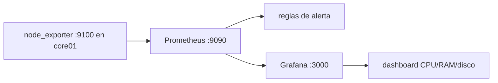

# Lab 04 · Observabilidad

**Tipo:** mixto. Desplegar Prometheus + Grafana + node exporter **es** el trabajo real de la Fase 4 del [roadmap](../roadmap/roadmap-general.md) — si se sigue [instalacion-stack.md](../observabilidad/instalacion-stack.md), el stack queda permanente. Lo descartable es la parte experimental de este lab: la carga artificial de CPU/disco usada para disparar la alerta a propósito.

## Objetivo

Agregar un exporter, un dashboard y una alerta al stack de observabilidad, generar consumo de CPU o disco de forma artificial y comprobar que el problema se detecta desde el dashboard/alerta **antes** de tener que entrar por SSH a mirar manualmente.

## Prerequisitos

- [Lab 02](./02-docker-compose.md) completado (Docker Compose funcionando en el host).
- Stack Prometheus + Grafana desplegado según [instalacion-stack.md](../observabilidad/instalacion-stack.md), o desplegarlo como parte de este lab si todavía no existe (Fase 4).
- Recursos: Prometheus + Grafana piden ~2 vCPU / 2-4 GB de base (ver [prometheus.md](../servicios/prometheus.md)); node exporter es prácticamente gratis (unos MB de RAM).

## Arquitectura



## Pasos

### 1. Node exporter en el host a monitorear

```yaml
services:
  node-exporter:
    image: prom/node-exporter:v1.8.2
    restart: unless-stopped
    network_mode: host
    pid: host
    volumes:
      - /:/host:ro,rslave
    command:
      - --path.rootfs=/host
```

`network_mode: host` es intencional acá (excepción a "no publicar 0.0.0.0 sin necesidad" de [docker-compose.md](../servicios/docker-compose.md)): node exporter necesita ver la red y el filesystem reales del host, no los de un contenedor aislado.

### 2. Target en Prometheus

Agregar a `prometheus.yml` (ver ejemplo completo en [instalacion-stack.md](../observabilidad/instalacion-stack.md)):

```yaml
scrape_configs:
  - job_name: node
    static_configs:
      - targets:
          - 'core01.oscar.home:9100'
```

```bash
curl -X POST http://localhost:9090/-/reload   # requiere --web.enable-lifecycle en el comando de Prometheus
```

### 3. Dashboard en Grafana

Provisionar o importar un dashboard de node exporter (el dashboard comunitario "Node Exporter Full", ID 1860, es un punto de partida habitual) apuntando al datasource Prometheus ya configurado.

### 4. Primera alerta

Siguiendo el ejemplo de [alertas.md](../observabilidad/alertas.md):

```yaml
groups:
  - name: lab04
    rules:
      - alert: DiskSpaceLow
        expr: node_filesystem_avail_bytes{mountpoint="/"} / node_filesystem_size_bytes{mountpoint="/"} < 0.15
        for: 15m
        labels:
          severity: warning
        annotations:
          summary: "Poco espacio en {{ $labels.instance }}"
          runbook: "/docs/runbooks/disco-lleno"
```

Para el lab, bajar temporalmente `for: 15m` a `for: 1m` para no esperar un cuarto de hora por cada intento — **revertir a 15m al terminar** (ver Cleanup).

### 5. Generar carga artificial

```bash
# CPU, dos minutos
stress-ng --cpu 4 --timeout 120s

# disco, archivo de relleno de 5 GB
fallocate -l 5G /srv/oscar/data/lab04/filler.img
```

### 6. Observar

Mirar el dashboard de Grafana durante la ventana de `stress-ng` y el estado de la regla en `http://localhost:9090/alerts` (pasa de `inactive` a `pending` y, tras cumplir el `for:`, a `firing`).

## Validación

```bash
curl -s http://core01.oscar.home:9100/metrics | head
```

- Prometheus `/targets` muestra el target `node` en estado `UP`.
- El dashboard de Grafana muestra el pico de CPU coincidiendo con la ventana de `stress-ng --timeout 120s`.
- Prometheus `/alerts` muestra `DiskSpaceLow` en `firing` después de crear el archivo de relleno y esperar el `for:` configurado.

## Qué aprendimos

El criterio de éxito real no es "la alerta existe", es "detectamos la degradación antes de entrar por SSH a mirar" — que es exactamente lo que se comprobó generando la carga y mirando el dashboard en vez del host. Esto es el gate de Fase 4 del roadmap hecho concreto, y es la base directa del [Lab 09](./09-fallo-controlado.md): ahí se sigue la misma cadena señal → diagnóstico → recuperación pero con una VM real caída en vez de una alerta simulada.

## Cleanup

```bash
rm /srv/oscar/data/lab04/filler.img
```

`stress-ng` se detiene solo por el `--timeout`; no requiere limpieza adicional. Revertir la regla de alerta a `for: 15m` (o el valor definitivo elegido) si se acortó para el lab, y quitar cualquier panel de Grafana agregado solo para ver el pico de prueba. El stack en sí (node exporter, Prometheus, Grafana, la alerta ya con su `for:` real) **queda desplegado**: es el servicio Objetivo de Fase 4, no se destruye.

## Troubleshooting

- **El target de node exporter aparece `down` en Prometheus** → falta `network_mode: host` o un firewall del host bloquea el puerto 9100 → `curl localhost:9100/metrics` desde el propio host que corre node exporter; si eso funciona pero Prometheus no lo alcanza, revisar reglas nftables si se aplicó [hardening-linux.md](../seguridad/hardening-linux.md).
- **Prometheus no recarga la regla de alerta nueva** → falta `--web.enable-lifecycle` en el comando del contenedor de Prometheus, o hay un error de sintaxis en el archivo de reglas → revisar `docker compose logs prometheus`; validar el YAML con `promtool check rules <archivo>` antes de recargar.
- **La alerta queda en `pending` y nunca pasa a `firing`** → la condición volvió a ser falsa antes de cumplirse el `for:` (la carga artificial terminó antes de tiempo) → extender `stress-ng --timeout`, o acortar el `for:` solo para el lab como en el paso 4.
