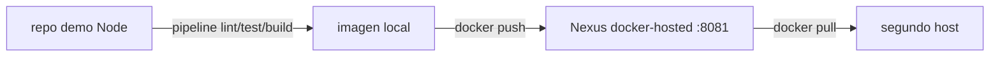

# Lab 05 · CI + Nexus

**Tipo:** mixto. Nexus **es** el servicio real objetivo de la Fase 5 ([nexus.md](../servicios/nexus.md)) y este lab lo usa de verdad. La imagen `lab05-demo` construida acá, en cambio, es descartable. El motor de CI concreto todavía es una [decisión pendiente](../servicios/ci-runner.md) (Forgejo Actions / GitLab Runner / Woodpecker); este lab no depende de esa decisión: simula el pipeline con un script local que corre las mismas etapas (lint → test → build → push) descritas en el [pipeline de referencia](../devops/pipeline-ejemplo.md).

## Objetivo

Construir una imagen Docker a partir de un pipeline (real o simulado localmente), pushearla a un repositorio Docker hosted en Nexus, y pullearla desde otro host para confirmar que el artefacto es versionado y reproducible de punta a punta.

## Prerequisitos

- Nexus desplegado con un repositorio Docker hosted configurado ([instalacion-nexus.md](../devops/instalacion-nexus.md)), corriendo en `devops01` (2-4 vCPU, 4-8 GB RAM según [nexus.md](../servicios/nexus.md)).
- [Lab 02](./02-docker-compose.md) completado como base de manejo de Docker Compose.
- Un segundo host o VM para probar el `pull` remoto — puede ser la VM del Lab 01 recreada, o cualquier otro host con Docker.

## Arquitectura



## Pasos

### 1. Repositorio Docker hosted en Nexus

Seguir [instalacion-nexus.md](../devops/instalacion-nexus.md) sección Docker/OCI si todavía no está configurado: crear un repositorio `docker-hosted`, deshabilitar acceso anónimo si no se necesita.

### 2. Pipeline simulado

Sin motor de CI decidido todavía, correr las mismas etapas a mano o en un script (`pipeline.sh`), igual que el pseudopipeline agnóstico de [pipeline-ejemplo.md](../devops/pipeline-ejemplo.md) pero ejecutable de verdad:

```bash
#!/usr/bin/env bash
set -euo pipefail

IMAGE="devops01.oscar.home:8081/lab05-demo"
TAG="$(git rev-parse --short HEAD)"

npm ci
npm test
docker build -t "$IMAGE:$TAG" .
docker login devops01.oscar.home:8081
docker push "$IMAGE:$TAG"
```

### 3. Pull desde otro host

```bash
docker login devops01.oscar.home:8081
docker pull devops01.oscar.home:8081/lab05-demo:<tag>
docker run --rm devops01.oscar.home:8081/lab05-demo:<tag>
```

### 4. Falla controlada

```bash
docker compose stop nexus   # en devops01
```

En el segundo host, reintentar el `pull` y observar el error de conexión. Levantar Nexus de nuevo y confirmar que el `pull` vuelve a funcionar sin necesidad de reconstruir ni republicar la imagen.

## Validación

- La UI de Nexus (Browse → `docker-hosted`) muestra el componente `lab05-demo` con el tag esperado.
- `docker images --digests` en el segundo host muestra el mismo digest que figura en la UI de Nexus para ese tag — confirma que es el mismo artefacto, no una reconstrucción.
- `curl -u <user>:<pass> https://devops01.oscar.home:8081/v2/lab05-demo/tags/list` lista el tag pusheado.

## Qué aprendimos

Un artefacto versionado y reproducible no depende de qué motor de CI lo produjo — depende de que exista un registry con un tag inmutable y que cualquier host autorizado pueda pullearlo sin reconstruirlo. Por eso este lab no bloquea contra el ADR de CI pendiente: lo que importa (el registry, el tag, la reproducibilidad) ya se puede practicar hoy. Este es también el primer eslabón real de lo que en el [Lab 07](./07-gitops.md) se convierte en un tag de imagen referenciado desde un manifiesto Git.

## Cleanup

```bash
docker rmi devops01.oscar.home:8081/lab05-demo:<tag>   # en ambos hosts
```

Borrar el componente de prueba desde la UI de Nexus (Browse → repositorio → seleccionar componente → Delete), o dejar que la política de cleanup configurada en [instalacion-nexus.md](../devops/instalacion-nexus.md) (paso 7) lo purgue automáticamente. Nexus en sí **no se destruye**: sigue siendo el servicio real de Fase 5.

## Troubleshooting

- **`docker login` a Nexus falla con `x509: certificate signed by unknown authority`** → Nexus expuesto sin TLS válido y Docker exige HTTPS por defecto → para el lab, agregar el registry a `insecure-registries` en `/etc/docker/daemon.json` y reiniciar Docker (**solo para laboratorio**; en producción resolver con TLS real, no con esta excepción).
- **`docker push` rechazado con `401 Unauthorized` aunque el login fue exitoso** → el repositorio Docker hosted no tiene habilitado el realm "Docker Bearer Token Realm" en Nexus → Administration → Security → Realms, habilitarlo (ver documentación oficial de Nexus para registries Docker).
- **Nexus se queda sin espacio y el `push` falla a mitad de camino** → sin cleanup policy, el blobstore crece sin límite → ver runbook [nexus-lleno.md](../runbooks/nexus-lleno.md).
