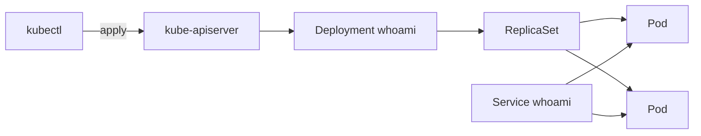

# Lab 06 · k3s

**Tipo:** descartable. Vive en el namespace `oscar-lab`, separado de cualquier carga real del cluster. La instalación de k3s en sí **no** es parte de este lab — es un prerequisito ya cubierto en [instalacion-k3s.md](../kubernetes/instalacion-k3s.md).

## Objetivo

Desplegar el Deployment/Service `whoami`, escalar réplicas, eliminar un pod a mano y observar cómo el ReplicaSet lo recrea, y hacer un rollout de imagen con su rollback. Entender la reconciliación continua de Kubernetes: la diferencia entre "correr un contenedor" (`docker run`, puntual) y "declarar un estado deseado que algo mantiene activamente" (Deployment, continuo).

## Prerequisitos

- k3s instalado y nodo en estado `Ready` ([instalacion-k3s.md](../kubernetes/instalacion-k3s.md)) — gate de Fase 6, no se repite acá.
- `kubectl` configurado localmente contra el cluster (kubeconfig copiado de forma segura, fuera de Git).
- Namespace `oscar-lab` creado (ver instalacion-k3s.md, sección Namespace).
- Recursos: mínimos — cada pod pide 20m CPU / 32Mi RAM (ver el manifest abajo) sobre el nodo `k3s01` (2-4 vCPU / 4-8 GB).

## Arquitectura



## Pasos

### 1. Namespace

```bash
kubectl get ns oscar-lab || kubectl create namespace oscar-lab
```

### 2. Manifest (el mismo que `examples/kubernetes/whoami/deployment.yaml`)

```yaml
apiVersion: apps/v1
kind: Deployment
metadata:
  name: whoami
  namespace: oscar-lab
spec:
  replicas: 2
  selector:
    matchLabels:
      app: whoami
  template:
    metadata:
      labels:
        app: whoami
    spec:
      containers:
        - name: whoami
          image: traefik/whoami:v1.11.0
          ports:
            - containerPort: 80
          resources:
            requests:
              cpu: 20m
              memory: 32Mi
            limits:
              memory: 128Mi
          readinessProbe:
            httpGet:
              path: /
              port: 80
            initialDelaySeconds: 3
            periodSeconds: 10
          livenessProbe:
            httpGet:
              path: /
              port: 80
            initialDelaySeconds: 5
            periodSeconds: 20
---
apiVersion: v1
kind: Service
metadata:
  name: whoami
  namespace: oscar-lab
spec:
  selector:
    app: whoami
  ports:
    - port: 80
      targetPort: 80
```

```bash
kubectl apply -f deployment.yaml
kubectl get deploy,pods,svc -n oscar-lab
```

### 3. Escalar

```bash
kubectl scale deployment whoami -n oscar-lab --replicas=4
kubectl get pods -n oscar-lab -w
```

### 4. Falla controlada: borrar un pod a mano

```bash
POD=$(kubectl get pods -n oscar-lab -l app=whoami -o jsonpath='{.items[0].metadata.name}')
kubectl delete pod "$POD" -n oscar-lab
kubectl get pods -n oscar-lab -w
```

El pod eliminado desaparece y aparece uno nuevo con otro nombre; el conteo total vuelve a 4 solo, sin intervención adicional.

### 5. Rollout de una nueva versión

```bash
kubectl set image deployment/whoami whoami=traefik/whoami:v1.10.3 -n oscar-lab
kubectl rollout status deployment/whoami -n oscar-lab
kubectl rollout history deployment/whoami -n oscar-lab
```

### 6. Rollback

```bash
kubectl rollout undo deployment/whoami -n oscar-lab
kubectl rollout status deployment/whoami -n oscar-lab
```

## Validación

```bash
kubectl get pods -n oscar-lab -l app=whoami
kubectl get deployment whoami -n oscar-lab -o jsonpath='{.spec.template.spec.containers[0].image}'
kubectl port-forward svc/whoami -n oscar-lab 8080:80 &
curl http://localhost:8080
```

Tras el paso 4 debe haber 4/4 pods `Running` (nuevo nombre, mismo conteo). Tras el rollback, la imagen reportada debe volver a `traefik/whoami:v1.11.0`. El `curl` por port-forward debe devolver el JSON de `whoami`.

## Qué aprendimos

El ReplicaSet mantiene activamente el número de réplicas declarado: borrar un pod no es "apagar un servicio", es forzar una reconciliación que Kubernetes ya está diseñado para hacer solo. Esto es distinto —y anterior— a la reconciliación que hace Argo CD en el [Lab 07](./07-gitops.md): acá el "estado deseado" vive en el objeto Deployment dentro del cluster (`kubectl` lo escribió); en GitOps, el estado deseado vive en Git y Argo CD es quien lo empuja al cluster. Entender esta capa primero hace que el drift de Argo CD en el próximo lab se vea como "un nivel más arriba de lo mismo" en vez de magia.

## Cleanup

```bash
kubectl delete -f deployment.yaml
kubectl get all -n oscar-lab   # confirmar que no queda nada de whoami
```

El namespace `oscar-lab` se reutiliza en el [Lab 07](./07-gitops.md): no borrarlo todavía.

## Troubleshooting

- **El pod nuevo queda en `ImagePullBackOff` tras el `kubectl set image`** → typo en el tag de imagen → `kubectl describe pod <pod> -n oscar-lab` para confirmar el evento; corregir el tag o hacer `kubectl rollout undo` directamente en vez de esperar a que falle solo.
- **`kubectl rollout status` queda colgado sin terminar** → el `readinessProbe` nunca pasa (puerto o path mal configurado) → `kubectl describe pod` para ver los eventos de la probe; comparar contra el `readinessProbe` del manifest (`path: /`, `port: 80`).
- **Un pod queda en `Pending`** → recursos insuficientes en el único nodo del cluster → ver [troubleshooting/kubernetes.md](../troubleshooting/kubernetes.md) sección Pending; `kubectl describe pod` para ver el evento de scheduling.
