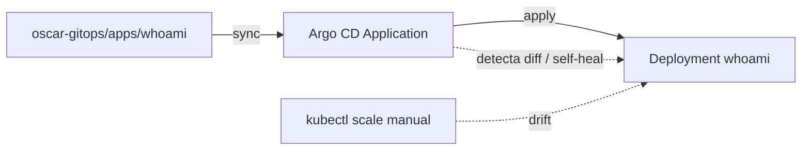

# Lab 07 · GitOps

**Tipo:** mixto. El ejercicio de drift/self-heal es descartable, pero el resultado final —`apps/whoami` en el repo GitOps gestionado por Argo CD— es exactamente el ejemplo permanente descrito en [gitops-demo.md](../despliegues/gitops-demo.md): conviene dejarlo como demo de referencia del repo en vez de borrarlo, salvo que se esté practicando en un cluster de laboratorio aislado.

## Objetivo

Mover la app `whoami` del [Lab 06](./06-k3s.md) a gestión declarativa vía Argo CD, provocar un cambio manual directo en el cluster para observar drift y self-heal, y hacer un cambio + revert por Git para comprobar el rollback declarativo.

## Prerequisitos

- [Lab 06](./06-k3s.md) completado y su Cleanup ejecutado (namespace `oscar-lab` existente pero sin recursos `whoami` gestionados a mano).
- Argo CD instalado ([instalacion-argocd.md](../kubernetes/instalacion-argocd.md)) y con bootstrap del repo GitOps hecho ([argocd-bootstrap.md](../kubernetes/argocd-bootstrap.md)).
- Acceso de escritura al repo `oscar-gitops`.
- Recursos: ~1-2 GB RAM adicionales para los componentes de Argo CD ([argocd.md](../servicios/argocd.md)).

## Arquitectura



## Pasos

### 1. Manifest en el repo GitOps

```text
oscar-gitops/
└── apps/
    └── whoami/
        └── deployment.yaml   # mismo contenido que el Lab 06
```

```bash
git add apps/whoami/deployment.yaml
git commit -m "whoami: agregar app de demo GitOps"
git push
```

### 2. Application de Argo CD

```yaml
apiVersion: argoproj.io/v1alpha1
kind: Application
metadata:
  name: whoami
  namespace: argocd
spec:
  project: default
  source:
    repoURL: https://git.oscar.home/oscar/oscar-gitops.git   # ajustar al repo real
    targetRevision: main
    path: apps/whoami
  destination:
    server: https://kubernetes.default.svc
    namespace: oscar-lab
  syncPolicy: {}
```

```bash
kubectl apply -f whoami-application.yaml -n argocd
kubectl get applications -n argocd
```

### 3. Sync manual (primero, antes de automatizar nada)

```bash
argocd app sync whoami
argocd app get whoami
```

### 4. Provocar drift manual

```bash
kubectl scale deployment whoami -n oscar-lab --replicas=5
argocd app get whoami   # debería mostrar OutOfSync
argocd app diff whoami
```

### 5. Reconciliar manualmente

```bash
argocd app sync whoami
kubectl get deploy whoami -n oscar-lab   # vuelve a 2 réplicas, el valor de Git
```

### 6. Habilitar auto-sync + self-heal

```bash
argocd app set whoami --sync-policy automated --self-heal --auto-prune
```

Repetir el drift del paso 4: esta vez el Deployment vuelve solo a 2 réplicas en segundos, sin `argocd app sync` manual.

### 7. Cambio real por Git

```bash
# editar apps/whoami/deployment.yaml: replicas: 2 -> replicas: 3
git add apps/whoami/deployment.yaml
git commit -m "whoami: escalar a 3 réplicas"
git push
argocd app get whoami   # Synced, 3 réplicas
```

### 8. Revert por Git

```bash
git revert HEAD --no-edit
git push
argocd app get whoami   # vuelve a 2 réplicas — rollback declarativo, cero kubectl
```

## Validación

- Tras el paso 4, `argocd app get whoami` muestra `OutOfSync` con el diff visible en `argocd app diff whoami` antes de sincronizar.
- Con self-heal activo (paso 6), `kubectl get deploy whoami -n oscar-lab -w` muestra el conteo de réplicas volviendo a 2 sin ningún `argocd`/`kubectl` manual de por medio.
- El `git revert` del paso 8 reduce las réplicas de 3 a 2 sin ejecutar un solo comando `kubectl`.

## Qué aprendimos

Git como fuente de verdad deja de ser una frase abstracta cuando se ve en vivo: el mismo `kubectl scale` que en el [Lab 06](./06-k3s.md) era la herramienta legítima para cambiar el cluster, acá es "drift" que Argo CD revierte. La diferencia no es técnica, es de intención declarada: lo que no está en Git no es el estado deseado, es una desviación. Este es el gate real de Fase 6 ("un cambio Git despliega y un revert revierte") y la base de por qué, de acá en adelante, los cambios a producción deberían pasar por un commit y no por un `kubectl apply` manual.

## Cleanup

**Si el cluster/repo son de práctica aislada:**

```bash
argocd app delete whoami --cascade
kubectl get all -n oscar-lab   # confirmar limpieza
```

Revertir también el commit que agregó `apps/whoami/` al repo si no se quiere dejar rastro.

**Si el repo `oscar-gitops` es el real:** dejar `apps/whoami/` en el repo como demo permanente (es lo que describe [gitops-demo.md](../despliegues/gitops-demo.md)); si de todos modos no se quiere consumir recursos del cluster en forma indefinida, borrar solo la Application de Argo CD (`argocd app delete whoami --cascade`) y dejar el manifest en Git para volver a sincronizar cuando haga falta.

## Troubleshooting

- **La Application queda en `Unknown` y nunca se pone healthy** → el pod `repo-server` de Argo CD no puede alcanzar el `repoURL` (credenciales o DNS) → `kubectl logs -n argocd deploy/argocd-repo-server`; `argocd repo list` para confirmar que el repo está agregado con credenciales válidas.
- **El self-heal no revierte el drift manual del paso 4** → `syncPolicy.automated` sin `selfHeal` solo sincroniza ante cambios en Git, no ante drift manual en el cluster → `argocd app set whoami --self-heal`; confirmar con `argocd app get whoami -o yaml | grep selfHeal`.
- **El commit en Git no dispara sync automático** → sin webhook configurado, Argo CD depende del poll periódico (cada 3 minutos por defecto) → esperar el poll o forzar `argocd app sync whoami`; ver también [argocd-outofsync.md](../runbooks/argocd-outofsync.md).
