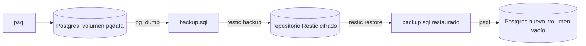

# Lab 08 · Backup y restore

**Tipo:** descartable. Usa el ejemplo `examples/docker-compose/postgres` con datos de prueba; ni la DB ni sus datos son reales. El objetivo no es la DB en sí, es medir el proceso de backup/restore contra la [estrategia 3-2-1](../backup-dr/estrategia-321.md) y el patrón de [restore drills](../backup-dr/restore-drill.md).

## Objetivo

Cargar datos de prueba en una instancia PostgreSQL, respaldarla, destruir su volumen (simulando pérdida total), restaurarla de forma aislada y medir el RTO (tiempo real de recuperación) — descubriendo en el camino qué dependencias no documentadas hacen falta para completar el restore.

## Prerequisitos

- [Lab 02](./02-docker-compose.md) completado.
- Ejemplo `examples/docker-compose/postgres` disponible en el repo (ya existe).
- Opcional pero recomendable: Restic disponible ([restic.md](../servicios/restic.md)) para practicar el backup contra un repositorio cifrado real en vez de una simple copia de archivo.
- Recursos: el contenedor Postgres pide ~0.5 vCPU / 256-512 MB.

## Arquitectura



## Pasos

### 1. Desplegar y cargar datos de prueba

```bash
cd examples/docker-compose/postgres
cp .env.example .env   # editar POSTGRES_PASSWORD
docker compose up -d
docker compose exec postgres psql -U oscar -d oscar_demo -c \
  "CREATE TABLE lab08_test (id serial primary key, nota text);
   INSERT INTO lab08_test (nota) VALUES ('dato de prueba lab08');"
```

### 2. Anotar el inicio del reloj de RTO

Registrar la hora exacta antes de continuar — es el dato que después va a importar más que cualquier comando.

### 3. Backup

```bash
docker compose exec -T postgres pg_dump -U oscar -d oscar_demo > lab08-$(date +%F).sql
wc -l lab08-*.sql   # confirmar que no está vacío
```

Con Restic (opcional):

```bash
restic -r <repo> backup lab08-$(date +%F).sql
```

### 4. Simular pérdida total

```bash
docker compose down -v
docker volume ls | grep pgdata   # ya no debe existir
```

### 5. Restaurar en aislamiento

```bash
docker compose up -d
docker compose exec -T postgres psql -U oscar -d oscar_demo < lab08-$(date +%F).sql
```

Con Restic:

```bash
restic -r <repo> restore latest --target ./restore
docker compose exec -T postgres psql -U oscar -d oscar_demo < ./restore/lab08-*.sql
```

### 6. Detener el reloj de RTO

Registrar la hora en la que el `SELECT` de la sección Validación devuelve el dato correcto. La diferencia contra el paso 2 es el RTO real de este servicio — no el estimado en la matriz de backup.

## Validación

```bash
docker compose exec postgres psql -U oscar -d oscar_demo -c "SELECT * FROM lab08_test;"
```

Debe devolver la fila `dato de prueba lab08`. Anotar el RTO medido junto al RPO/RTO documentado en la [matriz de backup](../backup-dr/matriz-backup.md) para esa categoría de dato, y registrar cualquier paso que haya hecho falta improvisar (ver "Qué aprendimos").

## Qué aprendimos

Un volumen Docker no es un backup — sobrevive a `docker compose down`, pero no a `docker compose down -v`, que es exactamente lo que se usó acá para simular la pérdida. El backup real es el archivo `pg_dump` (o el snapshot de Restic) fuera del volumen. El hallazgo más valioso de este lab casi nunca es el comando en sí, es la dependencia no documentada que aparece al restaurar en frío — típicamente una contraseña o una variable de entorno que solo existía en la memoria de quien desplegó el servicio la primera vez. Este mismo patrón, con una vuelta de tuerca (una encryption key adicional, igual de irrecuperable que la contraseña), es el que sigue el backup real de n8n ([backup-n8n.md](../backup-dr/backup-n8n.md)).

## Cleanup

```bash
docker compose down -v
rm lab08-*.sql
rm -rf ./restore   # si se usó Restic con --target
```

Si se usó un repositorio Restic compartido con backups reales de otros servicios, borrar solo el snapshot de prueba (`restic -r <repo> forget <snapshot-id> --prune`) — nunca correr un `forget --prune` amplio sobre un repositorio que tiene snapshots reales de otros servicios.

## Troubleshooting

- **`pg_dump` produce un archivo de 0 bytes** → falta el flag `-T` en `docker compose exec` (sin él, el pseudo-TTY mezcla el output con el prompt), o la tabla estaba vacía → repetir con `docker compose exec -T`; confirmar datos con `SELECT count(*)` antes del dump.
- **`psql ... < backup.sql` falla con `relation "lab08_test" already exists`** → se restauró sobre una instancia que todavía tenía el esquema aplicado, es decir el `down -v` del paso 4 no se ejecutó de verdad → confirmar volumen vacío nuevo antes de restaurar, o regenerar el dump con `pg_dump --clean` para que incluya los `DROP` previos.
- **No se puede reproducir la contraseña de Postgres al recrear el stack** → el `.env` correctamente no está en Git, pero tampoco se guardó en ningún gestor de secretos → es justamente la dependencia no documentada que este lab está diseñado para revelar; documentarla y mover la contraseña real a un gestor de secretos (ver [secretos.md](../seguridad/secretos.md)).
