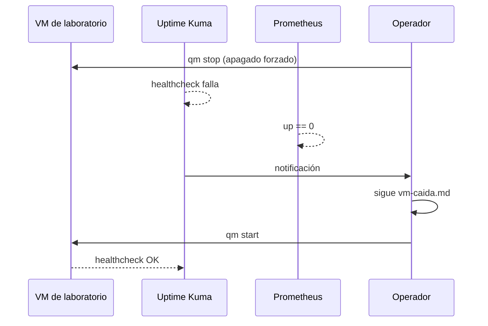

# Lab 09 · Fallo controlado

**Tipo:** no destructivo por diseño. No se destruye ninguna VM ni dato: se apaga y se vuelve a prender una VM de laboratorio ya existente, con el único propósito de validar que el monitoreo y el runbook reales funcionan bajo presión.

## Objetivo

Apagar de forma forzada una VM de laboratorio y seguir, sin atajos, la cadena completa alerta → diagnóstico → recuperación usando el runbook [vm-caida.md](../runbooks/vm-caida.md), para validar que el runbook alcanza y que el monitoreo detecta la falla en un tiempo razonable.

## Prerequisitos

- [Lab 01](./01-linux-ssh.md) (ciclo de vida de una VM) y [Lab 04](./04-observabilidad.md) (Prometheus + un chequeo de disponibilidad tipo Uptime Kuma monitoreando al menos un host) completados.
- Una VM de laboratorio real y prescindible bajo monitoreo — **nunca** `core01`, `devops01` o `k3s01` reales. Puede ser una recreación de la VM del Lab 01.
- El runbook [vm-caida.md](../runbooks/vm-caida.md), que ya existe en el repo.

## Arquitectura



## Pasos

### 1. Confirmar la línea base

Antes de tocar nada, confirmar que el monitor de Uptime Kuma y el target de Prometheus para la VM elegida están en verde/`UP`.

### 2. Anotar la hora de inicio

Es el dato que después permite calcular el MTTR real, no uno estimado.

### 3. Provocar la falla — apagado forzado, no `shutdown`

```bash
qm stop <vmid>
```

Deliberadamente `qm stop` (equivalente a cortar la energía) y no `qm shutdown` (graceful): un corte real no avisa.

### 4. Esperar la detección

Dejar que Uptime Kuma dispare su notificación y que Prometheus marque `up == 0` para ese target, según sus intervalos configurados — no adelantarse mirando la VM por otro lado todavía.

### 5. Seguir el runbook sin saltarse pasos

Ejecutar [vm-caida.md](../runbooks/vm-caida.md) de punta a punta como si no se supiera la causa, aunque en este caso sí se sepa (la provocamos nosotros). El objetivo del lab es validar que el runbook alcanza para alguien que no tiene ese contexto.

### 6. Recuperar

```bash
qm start <vmid>
```

### 7. Validar y cerrar

Confirmar IP, DNS y servicio recuperados, y que el monitoreo vuelve a verde. Completar la plantilla "Datos a registrar" del runbook (Inicio / Detección / Impacto / Causa / Acciones / Recuperación / Duración / Follow-up) con los tiempos reales medidos, no con estimaciones.

## Validación

- Uptime Kuma muestra el monitor en verde de nuevo, y su historial de downtime coincide con la ventana real entre el `qm stop` y la recuperación confirmada del servicio.
- `up{instance="<vm>"} == 1` en Prometheus.
- El tiempo entre "primera notificación" y "recuperación confirmada" quedó documentado — ese es el MTTR real del incidente simulado.
- El runbook se pudo seguir sin necesitar ningún paso que no estuviera escrito; si hizo falta improvisar algo, es un hallazgo del lab que hay que llevar de vuelta al runbook.

## Qué aprendimos

Un runbook que solo funciona en la cabeza de quien lo escribió no sirve durante un incidente real a las 3 AM. Este lab conecta directamente con el gate de Fase 4 ("una falla controlada genera señal y se puede recuperar") y con el [Lab 10](./10-ia-readonly.md): la misma cadena alerta → diagnóstico → recuperación que acá sigue un humano es la que más adelante un agente de IA read-only intenta reproducir de forma asistida — un runbook ambiguo confunde igual de bien a una persona que a un agente.

## Cleanup

No hay recursos que destruir: la VM vuelve a su estado normal de funcionamiento. Si durante el lab se editó el runbook para corregir algo, comitear esa mejora en vez de dejarla solo en notas locales. Si se silenció alguna alerta manualmente para el lab, quitar el silencio al terminar.

## Troubleshooting

- **Uptime Kuma nunca marca el monitor como down** → el intervalo de chequeo del monitor es más largo que la duración del lab, o el monitor apunta a un endpoint que sigue respondiendo por otra vía (proxy con cache, balanceo) → reducir el intervalo del monitor solo para el lab; confirmar que apunta directo a la VM.
- **`qm start` falla al intentar recuperar la VM** → storage no disponible o un lock residual de Proxmox tras el apagado forzado → `qm unlock <vmid>` si hay un lock huérfano; `pvesm status` para descartar problema de storage; si el problema es del host y no de la VM, ver [proxmox-inaccesible.md](../runbooks/proxmox-inaccesible.md).
- **El servicio dentro de la VM no vuelve solo tras `qm start`** → el proceso/contenedor no tenía política de reinicio automático (`restart: unless-stopped` en Compose, o el servicio no habilitado con `systemctl enable`) → revisar `docker compose ps` o `systemctl status` dentro de la VM; corregir la política de reinicio antes del próximo incidente real.
