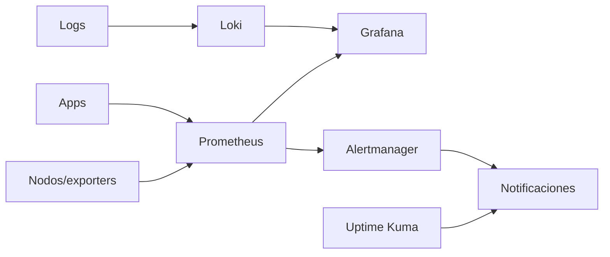

# Observabilidad

Queremos responder tres preguntas rápidamente:

1. ¿está caído?
2. ¿por qué está degradado?
3. ¿qué cambió antes de fallar?

## Golden signals caseras

- latencia;
- tráfico;
- errores;
- saturación.

A eso sumamos temperatura, batería UPS y salud de discos por tratarse de hardware doméstico.
