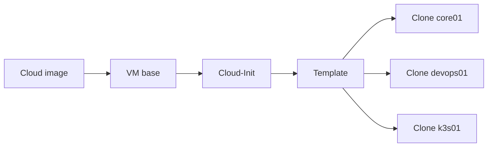

# Templates y Cloud-Init

Crear VMs a mano está bien una vez; repetirlo diez veces es una señal para automatizar.

## Objetivo

Mantener un template Ubuntu/Debian mínimo con:

- qemu-guest-agent;
- usuario administrativo;
- clave SSH;
- timezone;
- paquetes base;
- Cloud-Init.

## Flujo



## Comandos de referencia

Ejemplo con Ubuntu Server 24.04 cloud image sobre `local-lvm` (ajustar VMID, bridge y storage al ambiente real; no copiar IPs/VMIDs literalmente):

```bash
# 1. Descargar la cloud image oficial
wget https://cloud-images.ubuntu.com/noble/current/noble-server-cloudimg-amd64.img -O /var/lib/vz/template/iso/noble-cloudimg.qcow2

# 2. Crear la VM base (sin disco todavía)
qm create 9000 \
  --name ubuntu-2404-cloudinit-tpl \
  --memory 2048 --cores 2 \
  --net0 virtio,bridge=vmbr0 \
  --scsihw virtio-scsi-pci \
  --ostype l26

# 3. Importar el disco de la cloud image al storage elegido
qm importdisk 9000 noble-cloudimg.qcow2 local-lvm

# 4. Adjuntar el disco importado y el drive de Cloud-Init
qm set 9000 --scsi0 local-lvm:vm-9000-disk-0
qm set 9000 --ide2 local-lvm:cloudinit
qm set 9000 --boot order=scsi0
qm set 9000 --serial0 socket --vga serial0

# 5. Configurar usuario, clave SSH y red por defecto de la plantilla
qm set 9000 --ciuser oscar --sshkey ~/.ssh/oscar_id_ed25519.pub
qm set 9000 --ipconfig0 ip=dhcp

# 6. Convertir en template (ya no se puede iniciar directamente)
qm template 9000
```

Clonar el template para cada VM real (clon completo, no linked, para no depender del template en producción):

```bash
qm clone 9000 101 --name core01 --full
qm set 101 --ipconfig0 ip=192.168.20.11/24,gw=192.168.20.1   # ejemplo — usar el plan de direccionamiento real
qm start 101
```

## Después

Cloud-Init resuelve bootstrap. La configuración posterior puede evolucionar a Ansible para mantener idempotencia.

## Datos que no van en el template

- tokens permanentes;
- claves privadas compartidas;
- hostname fijo;
- IP duplicada;
- datos de aplicación.
