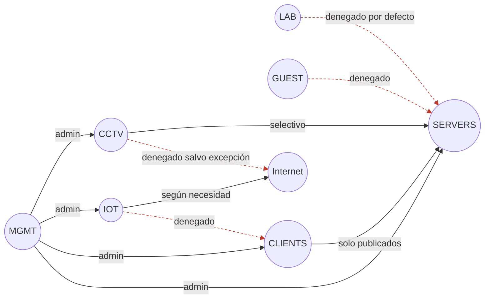

# VLAN y segmentación

Las VLAN no se agregan para hacer el diagrama más complejo; se agregan cuando permiten expresar una política de confianza.

## Matriz objetivo simplificada

| Origen | Destino | Regla general |
|---|---|---|
| MGMT | todos | permitido administrativamente |
| CLIENTS | SERVERS | solo servicios publicados |
| IOT | CLIENTS | denegado por defecto |
| IOT | Internet | permitido según necesidad |
| CCTV | Internet | denegado salvo requisito explícito |
| CCTV | NVR/HA | permitido selectivamente |
| GUEST | LAN | denegado |
| LAB | producción | denegado por defecto |

Flechas sólidas = permitido; punteadas rojas = denegado por defecto. El diagrama es una simplificación de la tabla de arriba — la tabla manda si hay diferencia.

## Cuándo implementarlas

Se requieren tres piezas coherentes:

1. firewall/router que entienda 802.1Q;
2. switch gestionable con VLAN;
3. AP capaz de mapear SSID a VLAN si queremos segmentación Wi-Fi.

Si falta una de estas piezas, documentar el diseño pero no crear una segmentación a medias que después sea difícil de diagnosticar.

## Trunk vs access

- **access/untagged**: dispositivo final que pertenece a una VLAN;
- **trunk/tagged**: enlace que transporta varias VLAN, por ejemplo firewall ↔ switch o switch ↔ host Proxmox.

## Proxmox

El bridge de Proxmox puede ser VLAN-aware para entregar redes diferentes a distintas VMs. Esto permite mantener un solo enlace físico si la NIC y el switch lo soportan.
