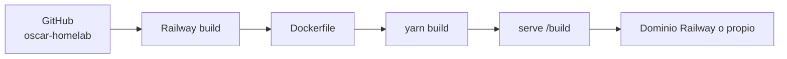

# Deploy de O.S.C.A.R. Docs en Railway

La documentación usa como base el patrón del template `railway-docusaurus-v3`: Docusaurus se compila como sitio estático dentro de una imagen Docker y Railway ejecuta esa imagen como un servicio web.

## Qué se despliega

El flujo es:



El servicio de documentación **no necesita base de datos** ni volumen persistente.

## 1. Crear el servicio

En Railway:

1. crear un proyecto;
2. elegir **Deploy from GitHub repo**;
3. seleccionar `rudemex/oscar-homelab`;
4. permitir que Railway use el `Dockerfile` del repositorio.

## 2. Variables recomendadas

### `SITE_URL`

URL pública completa del sitio:

```text
SITE_URL=https://oscar.example.com
```

Si se usa inicialmente el dominio generado por Railway:

```text
SITE_URL=https://<servicio>.up.railway.app
```

### `BASE_URL`

Normalmente no hace falta definirla:

```text
BASE_URL=/
```

Solo cambiarla si la documentación se publica realmente debajo de un subpath.

:::warning
No usar `/oscar-homelab/` simplemente porque el repositorio tenga ese nombre. En Railway, con dominio propio o dominio del servicio, normalmente O.S.C.A.R. se sirve desde `/`.
:::

## 3. Puerto

Railway inyecta `PORT`. El `Dockerfile` la consume automáticamente:

```dockerfile
CMD ["sh", "-c", "serve -s build -l ${PORT:-3000}"]
```

No hay que fijar manualmente un puerto público.

## 4. Health check

Como primera opción se puede usar:

```text
/
```

Una mejora futura es crear una página estática dedicada, por ejemplo `/health`, si queremos desacoplar la validación del contenido de la portada.

## 5. Deploy automático

Con la integración GitHub → Railway habilitada, un merge a la rama configurada dispara un nuevo build.

Antes del merge, GitHub Actions ejecuta:

```bash
yarn typecheck
yarn build
```

Por lo tanto, el flujo deseado es:

```text
branch
  ↓
Pull Request
  ↓
Validate documentation
  ↓
merge
  ↓
Railway build
  ↓
deploy
```

## 6. Rollback

La documentación es estática, por lo que un rollback consiste en volver al deployment anterior desde Railway o revertir el commit que introdujo el problema.

No hay migraciones de datos asociadas al sitio.

## 7. Validación post-deploy

Después de cada cambio importante comprobar:

- portada;
- navegación lateral;
- búsqueda/navegación entre documentos;
- diagramas Mermaid;
- bloques de código;
- modo claro/oscuro;
- links a GitHub;
- links internos principales;
- versión móvil.

## Ejemplo de Definition of Done

```text
[ ] yarn build exitoso
[ ] Railway deploy healthy
[ ] / responde HTTP 200
[ ] /docs/intro abre correctamente
[ ] sidebar renderiza
[ ] Mermaid renderiza
[ ] dark mode funciona
[ ] no se publicaron secretos
```
