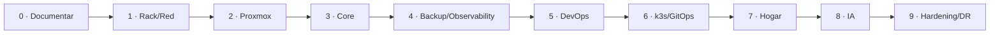

# Roadmap de construcción

El roadmap evita instalar componentes fuera de orden.

## Fase 0 · Fuente de verdad

- [x] estructura Docusaurus;
- [ ] cerrar inventario real;
- [ ] registrar fotos/diagramas del rack;
- [ ] naming e IP plan;
- [ ] ADR del switch final.

**Gate:** sabemos qué tenemos y qué falta.

## Fase 1 · Rack y red

- montar patch panel;
- instalar switch gigabit gestionable;
- etiquetar puertos;
- medir enlaces;
- organizar energía/ventilación;
- documentar red actual.

**Gate:** todos los enlaces negocian correctamente y el cableado es trazable.

## Fase 2 · Proxmox

- backup previo del Dell;
- instalar Proxmox;
- storage;
- bridge;
- template Cloud-Init;
- VM de prueba;
- backup inicial.

**Gate:** una VM puede crearse, respaldarse, destruirse y restaurarse.

## Fase 3 · Core services

- VM Core;
- Docker Compose;
- DNS secundario/estrategia DNS;
- reverse proxy/acceso interno;
- n8n base;
- Uptime Kuma.

**Gate:** servicios tienen health y persistencia documentada.

## Fase 4 · Observabilidad y backup

- Prometheus;
- Grafana;
- exporters;
- alertas mínimas;
- backups automáticos;
- primer restore drill;
- dashboard pantalla 9".

**Gate:** una falla controlada genera señal y se puede recuperar desde backup.

## Fase 5 · DevOps

- Nexus;
- Git local o integración elegida;
- runner;
- pipeline de demo;
- image scanning opcional.

**Gate:** commit produce artefacto versionado en registry.

## Fase 6 · Kubernetes/GitOps

- k3s single-node;
- app demo;
- Argo CD;
- repo GitOps;
- observabilidad del cluster;
- backup/rebuild procedure.

**Gate:** un cambio Git despliega y un revert revierte.

## Fase 7 · Hogar

- Home Assistant;
- sensores del rack;
- CCTV segmentado cuando VLAN exista;
- Internet probe;
- automatizaciones útiles.

## Fase 8 · IA

- RAG de documentación;
- herramientas read-only;
- integración de métricas/logs;
- acciones seguras mediante n8n/MCP;
- auditoría.

## Fase 9 · Hardening/DR

- OPNsense y VLAN completas;
- segunda copia off-site;
- secretos maduros;
- restore drills;
- disaster game day;
- revisión de permisos de agentes.
