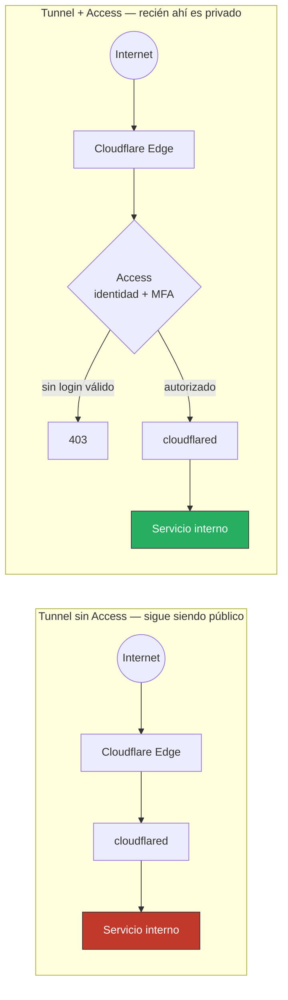

# Exposición

## Regla explícita

**Ningún panel administrativo se expone directo a Internet.** Esto incluye, como mínimo: Proxmox, Grafana, Argo CD, Nexus, n8n y Home Assistant. [Cloudflare Tunnel](../servicios/cloudflare-tunnel.md) por sí solo **no** cumple esta regla — un Tunnel sin Access sigue siendo un servicio público, solo que sin puerto abierto en el router. Un servicio detrás de Tunnel se considera "privado" únicamente cuando también tiene Cloudflare Access (identidad + MFA + política) delante.

La diferencia entre los dos escenarios no es el Tunnel — es si existe una Access Application con política delante del hostname antes de crear el registro DNS. Ver el orden de despliegue seguido en la práctica en [Cloudflare Tunnel + Access](../servicios/cloudflare-tunnel.md).

| Servicio | Exposición permitida |
|---|---|
| Proxmox UI | nunca directo a Internet; solo VPN/MGMT |
| Grafana | Tunnel + Access (identidad + MFA) si se necesita acceso remoto |
| Argo CD | nunca directo; VPN o `kubectl port-forward` desde MGMT |
| Nexus | nunca directo; VPN o Tunnel + Access si hay consumidores externos reales |
| n8n | Tunnel + Access para la UI; webhooks públicos van por endpoint específico, no por la UI completa |
| Home Assistant | Tunnel + Access, o VPN; nunca puerto abierto en el router |
| CCTV / DVR | nunca directo; VLAN aislada + acceso vía VPN/Access, deshabilitar P2P/DDNS del fabricante |
| Demo web pública (whoami, proyecto de práctica) | reverse proxy/Tunnel, TLS, sin necesidad de Access si el contenido no es sensible |

## Checklist antes de publicar

- [ ] ¿necesita ser público realmente?
- [ ] si es un panel administrativo, ¿tiene Access delante del Tunnel (no solo el Tunnel)?
- [ ] autenticación fuerte (MFA cuando el servicio lo permite);
- [ ] TLS;
- [ ] rate limiting cuando aplica;
- [ ] logs;
- [ ] versión soportada;
- [ ] backup;
- [ ] no contiene panel administrativo oculto sin Access;
- [ ] reverse proxy/tunnel actualizado;
- [ ] datos sensibles entendidos.

## Preferencia

Administración → VPN / identidad Zero Trust (Cloudflare Access u equivalente), nunca Tunnel solo.
Aplicación pública sin datos sensibles → reverse proxy/tunnel, mínimo puerto, autenticación según función.
Webhook → endpoint específico, firma/token, no publicar toda la UI.

Ver también: [Cloudflare Tunnel + Access](../servicios/cloudflare-tunnel.md), [ADR-005 · Exposición externa mínima](../arquitectura/decisiones-arquitectonicas.md#adr-005--exposición-externa-mínima), [ADR-006 · Cloudflare Tunnel + Access](../arquitectura/decisiones-arquitectonicas.md#adr-006--cloudflare-tunnel--access-para-acceso-remoto).
