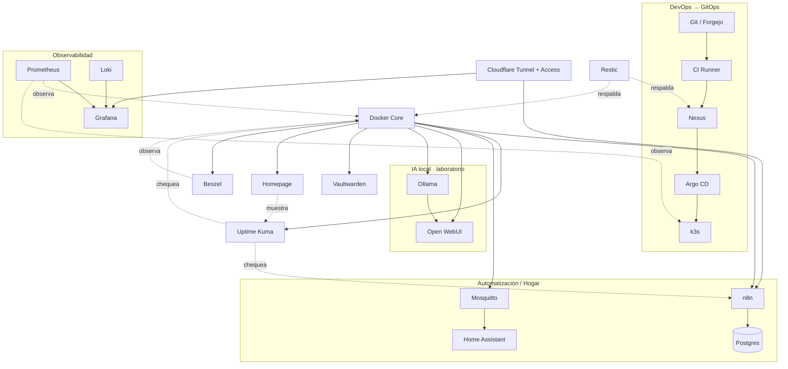

# Catálogo de servicios

La tabla resume el rol previsto. **Objetivo** no significa “instalar ya”: cada servicio entra cuando su fase del roadmap lo requiere.

| Servicio | Estado | Ubicación sugerida | Para qué lo usamos |
|---|---|---|---|
| [Docker y Docker Compose](./docker-compose.md) | **Actual** · Core | VM `core01` | ejecutar n8n, Uptime Kuma, dashboards y utilidades |
| [EasyPanel](./easypanel.md) | Laboratorio · Plataforma de apps | VM Docker dedicada o `core01` durante la etapa inicial | comparar un PaaS casero contra el flujo GitOps; redundante con Compose+k3s si no aporta algo distinto |
| [Sonatype Nexus Repository](./nexus.md) | Objetivo · DevOps | VM `devops01` | proxy/cache de npm |
| [Forgejo / Git local](./forgejo.md) | Objetivo · Decisión pendiente | VM `devops01` o VM pequeña dedicada | mirror de repositorios importantes |
| [CI Runner](./ci-runner.md) | Objetivo · Decisión pendiente | VM `devops01` o runners efímeros | compilar proyectos Node |
| [Argo CD](./argocd.md) | Objetivo · GitOps | cluster k3s | sincronizar Helm/manifests |
| [Prometheus](./prometheus.md) | Objetivo · Observabilidad | VM observabilidad o k3s, según fase | métricas de hosts |
| [Grafana](./grafana.md) | Objetivo · Observabilidad | VM observabilidad o Docker Core | dashboard de rack |
| [Loki](./loki.md) | Objetivo · Logs | VM observabilidad o k3s | logs de contenedores |
| [Uptime Kuma](./uptime-kuma.md) | **Actual** · Disponibilidad | Docker Core | HTTP checks |
| [n8n](./n8n.md) | **Actual** · Automatización | Docker Core | backups coordinados |
| [Vaultwarden](./vaultwarden.md) | **Actual** · Seguridad | Docker Core | gestor de contraseñas propio (Bitwarden-compatible) |
| [Homepage](./homepage.md) | **Actual** · Dashboard | Docker Core | landing con links/estado de todos los servicios |
| [Beszel](./beszel.md) | **Actual** · Observabilidad | Docker Core | monitoreo liviano de CPU/RAM/disco, alternativa a Prometheus+Grafana |
| [Home Assistant](./home-assistant.md) | **Actual** · Hogar | VM dedicada (vmid 101) | automatización doméstica |
| [ProxMenux Monitor](./proxmenux-monitor.md) | **Actual** · Observabilidad | systemd en `oscar-core` | dashboard de CPU/RAM/disco/red del hipervisor, instalado fuera de Docker |
| [Glances](./glances.md) | **Actual** · Observabilidad | Docker Core | fuente de datos real de CPU/RAM/disco de `core01` para el header de Homepage, con tarjeta y UI propia (procesos, red, contenedores) |
| [MySpeed](./myspeed.md) | **Actual** · Observabilidad | Docker Core | historial de velocidad de internet, tests automáticos |
| [Nginx Proxy Manager](./nginx-proxy-manager.md) | **Actual** · Infraestructura | Docker Core | reverse proxy interno para tráfico dentro de la LAN, no reemplaza al Tunnel |
| [Cloudflare Tunnel + Access](./cloudflare-tunnel.md) | **Actual** · Acceso remoto | Docker Core | publica Vaultwarden/n8n/Kuma/Homepage/Beszel/ProxMenux Monitor sin abrir puertos, cada uno con Access delante |
| [Eclipse Mosquitto MQTT](./mosquitto.md) | Laboratorio / Hogar | Raspberry Pi o VM Core | sensores Pi Zero |
| [Ollama](./ollama.md) | Laboratorio · IA local | Dell/VM solo para modelos compatibles con recursos; hardware futuro para cargas mayores | probar LLM local |
| [Open WebUI](./open-webui.md) | Laboratorio · IA | Docker Core conectado a proveedor/modelo permitido | UI para Ollama |
| [Restic](./restic.md) | Objetivo · Backup | clientes/VMs que necesiten backup de archivos | backup de configs |
| [MinIO](./minio.md) | Laboratorio · Object Storage | VM/storage de laboratorio | aprender API S3 |

## Mapa de dependencias

Flechas sólidas = "necesita para funcionar"; punteadas = "observa/respalda sin ser una dependencia dura" (el servicio observado sigue funcionando si Prometheus o Restic están caídos, al revés no). EasyPanel y MinIO quedan fuera del mapa a propósito: son laboratorios independientes, sin integrarse todavía al resto.

## Criterio de adopción

Antes de sumar un servicio, responder:

1. ¿qué problema real resuelve?
2. ¿ya tenemos otro servicio que resuelve lo mismo?
3. ¿qué datos persistirá?
4. ¿qué backup necesita?
5. ¿cómo sabremos que está sano?
6. ¿qué dependencia nueva introduce?
7. ¿podemos destruirlo y reconstruirlo desde Git?

El objetivo no es maximizar la cantidad de logos del dashboard; es maximizar lo que aprendemos y lo fácil que resulta operar el conjunto.

Minecraft y Counter-Strike 2 no están en esta tabla a propósito: no son servicios de infraestructura, viven en su propia sección — ver [servidores de juegos](../juegos/vision-general.md).
