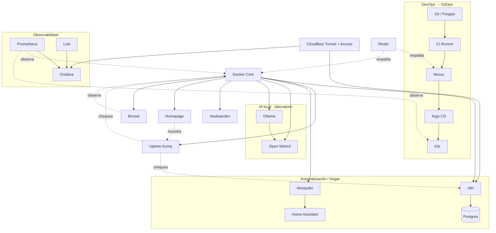

# Catálogo de servicios

La tabla resume el rol previsto. **Objetivo** no significa “instalar ya”: cada servicio entra cuando su fase del roadmap lo requiere.

| Servicio | Estado | Ubicación sugerida | Para qué lo usamos |
|---|---|---|---|
| [Docker y Docker Compose](./docker-compose.md) | **Actual** · Core | VM `core` | dashboards y utilidades (n8n y Uptime Kuma migraron a `automation`/`monitor`, ver `REORGANIZACION_RACK.md`) |
| [EasyPanel](./easypanel.md) | Laboratorio · Plataforma de apps | VM Docker dedicada o `core` durante la etapa inicial | comparar un PaaS casero contra el flujo GitOps; redundante con Compose+k3s si no aporta algo distinto |
| [Sonatype Nexus Repository](./nexus.md) | **Actual** · DevOps | VM `devops` | proxy/cache de npm y registry Docker privado, usado por el CI real |
| [Forgejo / Git local](./forgejo.md) | **Actual** · DevOps | VM `devops` | origen real de `oscar-gitops` (ya no mirror), repos privados del homelab, GitOps completamente local |
| [CI Runner](./ci-runner.md) | **Actual** · DevOps (Forgejo Actions) | VM `devops` | pipeline real validado: lint → test → build → push a Nexus → actualiza GitOps → Argo CD despliega |
| k3s + Traefik | **Actual** · Kubernetes | VM `k3s` | cluster de un solo nodo, ingress controller para las apps con `*.oscar.home` |
| [Argo CD](./argocd.md) | **Actual** · GitOps | cluster k3s (`k3s`) | sincroniza `oscar-gitops` (Forgejo) — `root-app`, `oscar-led-controller`, `ci-demo` |
| [Prometheus](./prometheus.md) | Objetivo · Observabilidad | VM observabilidad o k3s, según fase | métricas de hosts |
| [Grafana](./grafana.md) | Objetivo · Observabilidad | VM observabilidad o Docker Core | dashboard de rack |
| [Loki](./loki.md) | Objetivo · Logs | VM observabilidad o k3s | logs de contenedores |
| [Uptime Kuma](./uptime-kuma.md) | **Actual** · Disponibilidad | Docker Core | HTTP checks |
| [n8n](./n8n.md) | **Actual** · Automatización | Docker Core | backups coordinados |
| [Vaultwarden](./vaultwarden.md) | **Actual** · Seguridad | Docker `services` (migrado de Core el 2026-09-23) | gestor de contraseñas propio (Bitwarden-compatible) |
| [Homepage](./homepage.md) | **Actual** · Dashboard | Docker Core | landing con links/estado de todos los servicios |
| [Beszel](./beszel.md) | **Actual** · Observabilidad | Docker Core | monitoreo liviano de CPU/RAM/disco, alternativa a Prometheus+Grafana |
| [Home Assistant](./home-assistant.md) | **Actual** · Hogar | VM dedicada (vmid 101) | automatización doméstica |
| [ProxMenux Monitor](./proxmenux-monitor.md) | **Actual** · Observabilidad | systemd en `oscar-core` | dashboard de CPU/RAM/disco/red del hipervisor, instalado fuera de Docker |
| [Glances](./glances.md) | **Actual** · Observabilidad | Docker Core | fuente de datos real de CPU/RAM/disco de `core` para el header de Homepage, con tarjeta y UI propia (procesos, red, contenedores) |
| [MySpeed](./myspeed.md) | **Actual** · Observabilidad | Docker Core | historial de velocidad de internet, tests automáticos |
| [Portainer](./portainer.md) | **Retirado (2026-09-25)** · Infraestructura | — | era una consola de contenedores/logs de `core`+`devops`; eliminado por decisión del usuario ("no nos sirve"), ver la página |
| [Nginx Proxy Manager](./nginx-proxy-manager.md) | **Actual** · Infraestructura | Docker Core | reverse proxy interno para las apps de Docker Compose (Forgejo); las apps de k3s van directo a Traefik, no por acá |
| [Relay SMTP (Brevo)](./smtp-relay.md) | **Actual** · Infraestructura | Docker Core | `boky/postfix` relay-only, para que otros servicios (ej. Vaultwarden) puedan mandar mail sin exponer credenciales SMTP reales a cada uno |
| [Cloudflare Tunnel + Access](./cloudflare-tunnel.md) | **Actual** · Acceso remoto | Docker Core | publica Vaultwarden/n8n/Kuma/Homepage/Beszel/ProxMenux Monitor/Home Assistant sin abrir puertos, cada uno con Access delante (7 hostnames reales) |
| [Eclipse Mosquitto MQTT](./mosquitto.md) | Laboratorio / Hogar | Raspberry Pi o VM Core | sensores Pi Zero |
| [Ollama](./ollama.md) | Laboratorio · IA local | Dell/VM solo para modelos compatibles con recursos; hardware futuro para cargas mayores | probar LLM local |
| [Open WebUI](./open-webui.md) | Laboratorio · IA | Docker Core conectado a proveedor/modelo permitido | UI para Ollama |
| [Restic](./restic.md) | Objetivo · Backup | clientes/VMs que necesiten backup de archivos | backup de configs |
| [MinIO](./minio.md) | Laboratorio · Object Storage | VM/storage de laboratorio | aprender API S3 |

## Mapa de dependencias

Flechas sólidas = "necesita para funcionar"; punteadas = "observa/respalda sin ser una dependencia dura" (el servicio observado sigue funcionando si Prometheus o Restic están caídos, al revés no). EasyPanel y MinIO quedan fuera del mapa a propósito: son laboratorios independientes, sin integrarse todavía al resto.

## Criterio de adopción

Antes de sumar un servicio, responder:

1. ¿qué problema real resuelve?
2. ¿ya tenemos otro servicio que resuelve lo mismo?
3. ¿qué datos persistirá?
4. ¿qué backup necesita?
5. ¿cómo sabremos que está sano?
6. ¿qué dependencia nueva introduce?
7. ¿podemos destruirlo y reconstruirlo desde Git?

El objetivo no es maximizar la cantidad de logos del dashboard; es maximizar lo que aprendemos y lo fácil que resulta operar el conjunto.

## Candidatos evaluados, no decididos todavía

Investigación de qué más tendría sentido traer al homelab (disparada por un repaso de [railway.app/templates](https://railway.com/templates) — la mayoría de lo que ahí aparece es tooling de desarrollo específico de Railway, no aplicable acá; esta lista es más amplia que solo lo que aparece ahí). Es una lista de **candidatos para evaluar**, no un compromiso de implementación — pasan por el mismo [criterio de adopción](#criterio-de-adopción) de arriba antes de instalarse.

**Descartadas (2026-09-17):** `Immich`, `Jellyfin`, `Trilium Notes`, `Vikunja` y `Linkding` se evaluaron y el usuario decidió no sumarlas — queda anotado acá para no volver a proponerlas de nuevo más adelante como si fueran hallazgos nuevos.

### Stirling PDF, Paperless-ngx y Nextcloud no son redundantes entre sí

Los tres tocan "documentos", pero cada uno responde una pregunta distinta — no compiten entre sí, así que no hace falta elegir uno solo, y aprobar uno no implica los otros:

| App | Pregunta que responde | Ejemplo |
|---|---|---|
| **Stirling PDF** (ya aprobada, Fase 8) | "Quiero *hacer algo* con este PDF" | convertir, OCR puntual, merge, comprimir, vía API |
| **Paperless-ngx** (evaluación) | "Quiero *guardar y encontrar* mis documentos" | archivo, clasificación, OCR, búsqueda full-text |
| **Nextcloud** (evaluación) | "Quiero mi propia *nube*" | archivos, sync, compartir, Office online |

Por eso Stirling PDF ya está aprobada sola, sin que eso implique instalar Paperless-ngx o Nextcloud: resuelve una tarea puntual y sin estado (herramienta), no acumula archivos/documentos propios como los otros dos.

### Karakeep — candidata ascendida, con una dirección de arquitectura real (2026-09-17)

De las candidatas en evaluación, `Karakeep` (bookmarking con full-text + búsqueda semántica, OCR, etiquetado/resumen con LLM) pasa a ser la primera en consideración, por delante de Docuseal/Nextcloud/Paperless-ngx/Firefly III — no por sí sola, sino por cómo encaja con la dirección que está tomando la [capa de IA de O.S.C.A.R.](../ia/vision-general.md#oscar-ai--capacidades-no-el-recorrido-técnico-de-una-request-candidato-de-arquitectura): junto con SearXNG (ya aprobada) y n8n (ya desplegado) formaría la capa de "conocimiento" que alimenta a Open WebUI (también ya aprobada) como front-end único. Ver el diagrama en esa página (refinado 2026-09-17, con el layer de LLM providers detrás de Open WebUI) — sigue siendo candidato de arquitectura, no una decisión tomada, pero es la razón real detrás de subir a Karakeep en la cola.

**Evaluación con criterio de adopción (2026-09-24):** proyecto activo y sano (28k+ estrellas, releases constantes, última v0.31.0). La búsqueda semántica puede apuntar a un Ollama local — no obliga a depender de la nube, y encaja de verdad como capa de conocimiento, no solo bookmark manager. (1) hueco real, nada hoy lo resuelve; (2) sin superposición con SearXNG/n8n; (3) bookmarks/notas/imágenes — dato real e irreemplazable; (4) sí, necesita su propio backup; (5) bajo, un contenedor + DB; (6) DB propia (Postgres/SQLite) + llamada opcional a Ollama, sin sumar un servicio pesado nuevo si Ollama ya está en el plan; (7) tiene estado real y creciente.

**Pasó a Actual el 2026-09-25** — el backup off-site quedó confirmado como bloqueado sin fecha (sin presupuesto ni segundo lugar físico, ver [estrategia 3-2-1](../backup-dr/estrategia-321.md#destino-off-site)), y el usuario decidió instalarla igual, mismo riesgo ya aceptado con DocuSeal/Paperless-ngx. Desplegada en `services`: `web` + `chrome` (headless, para scraping) + `meilisearch` (búsqueda full-text), sin Ollama todavía (queda para cuando haya hardware de IA real). Acceso: `karakeep.oscar.home`. Cuenta sin crear todavía — paso manual del usuario.

**Paperless-ngx: pasó a Actual el mismo 2026-09-24**, pese a la recomendación de diferir de la evaluación de arriba — el usuario decidió instalarla igual, asumiendo el riesgo de no tener backup off-site todavía para los documentos escaneados (mismo riesgo que corre `DocuSeal`, ya asumido antes). Desplegada en `services` (LXC, `/srv/oscar/apps/paperless/`), stack completo de referencia: Postgres 18 + Valkey (Redis) + Tika 3.3.1 + Gotenberg 8.37 + webserver, todo con bind mounts (no volúmenes nombrados de Docker, mismo criterio que el resto del proyecto). `services` se agrandó de 2GB/16GB a 4GB/40GB antes de sumar esto (headroom real para el crecimiento de documentos). Acceso: `paperless.oscar.home` vía NPM → `192.168.0.154:8000`. Cuenta de admin sin crear todavía — paso manual del usuario (`docker exec -it paperless-webserver python3 manage.py createsuperuser`), mismo criterio que DocuSeal.

### Tabla de candidatos (sin Karakeep y sin Paperless-ngx, ya tratados arriba)

**DocuSeal ya no es candidato — pasó a Actual el 2026-09-23**, desplegado en `services` en su modo standalone (SQLite embebida, no Postgres+Redis separados como decía la fila de abajo — para el volumen de un homelab alcanza y sobra). Fila conservada por el análisis de "criterio de adopción" más abajo, que sigue siendo válido.

| App | Qué hace | Necesidad real / qué reemplazaría | Esfuerzo | Dónde |
|---|---|---|---|---|
| ~~[Docuseal](https://www.docuseal.com/)~~ **Actual (2026-09-23)** | Firma electrónica de documentos (PDF/Word), campos drag-and-drop, plantillas, auditoría | Alternativa a DocuSign/HelloSign — firmar sin depender de un tercero | Bajo en la práctica — imagen standalone, un solo contenedor | `services` (LXC, Docker Compose) |
| [Nextcloud](https://nextcloud.com/) | Sync/share de archivos, calendario, contactos, edición colaborativa | Reemplaza Google Drive/Dropbox — el único candidato de esta lista con volumen de datos real y creciente | Alto — PHP+DB+caché, más pesado que el resto de esta lista junta | Docker Compose, `core` (o VM propia si crece) |
| ~~[Garage](https://garagehq.deuxfleurs.fr/)~~ **Actual (2026-09-24)** | Storage S3-compatible, pensado para clusters chicos/homelab (Rust, footprint bajo) | Ganó sobre MinIO — ver "Decisiones futuras de plataforma" abajo. Sin consumidor real todavía, desplegado preventivamente | Bajo | `services` (LXC, Docker Compose) |
| ~~Firefly III~~ → **[Actual Budget](https://actualbudget.org/)** (migrado 2026-09-24) | Finanzas personales — presupuesto por sobres estilo YNAB, sync bancario real (GoCardless/SimpleFIN) | Ninguna herramienta hoy cubre esto | Bajo — más liviano que Firefly III, SQLite propio | Docker Compose |

**Criterio de adopción aplicado a las dos más fuertes** (las que el usuario recordaba específicamente):

- **Docuseal** — (1) firmar documentos sin depender de un SaaS de terceros; (2) nada hoy resuelve esto; (3) PDFs/Word originales + metadata de firmas en Postgres — dato real, no recreable si se pierde; (4) sí, backup de Postgres + del volumen de documentos, mismo criterio que cualquier servicio con estado real (ver [estrategia 3-2-1](../backup-dr/estrategia-321.md)); (5) healthcheck HTTP simple; (6) Postgres + Redis nuevos si no se reusan los que ya corren en `core`/`k3s`; (7) sí, stateless en config — el estado real (documentos firmados) necesita su propio backup, no alcanza con reconstruir desde Git.
- **Nextcloud** — (1) sync/share de archivos sin depender de Google/Dropbox; (2) nada hoy resuelve esto — es el hueco más real de la lista; (3) archivos de usuario reales, potencialmente mucho volumen, crece sin techo claro; (4) sí, y es el más importante de toda la lista — perder esto es perder archivos personales reales, no una config reconstruible; (5) healthcheck HTTP + espacio en disco disponible; (6) PHP+DB+caché, la pieza más pesada de mantener actualizada de toda la lista; (7) no del todo — la config sí, los archivos de usuario no, por diseño (son el objetivo del servicio, no un efecto secundario).

Docuseal, Nextcloud, Karakeep, Paperless-ngx y Actual Budget son las que tienen datos de usuario genuinos e irreemplazables — a diferencia de casi todo lo demás en este catálogo, que es reconstruible desde Git. La estrategia de backup off-site sigue **bloqueada sin fecha** (sin presupuesto ni segundo lugar físico, ver [estrategia 3-2-1](../backup-dr/estrategia-321.md#destino-off-site)) — Docuseal, Paperless-ngx, Karakeep y Actual Budget ya se instalaron igual, riesgo aceptado explícitamente por el usuario. Nextcloud es la única que sigue esperando (no evaluada todavía en esta ronda).

**Firefly III → Actual Budget, decidido (2026-09-24), instalada el 2026-09-25.** Más liviano, arranca más rápido, sync bancario real ya integrado — encaja mejor con el criterio de esfuerzo bajo que se viene usando en todo este catálogo. Si en algún momento hace falta contabilidad de partida doble formal, ahí se reconsidera Firefly III. Mismo criterio que Karakeep: el backup off-site quedó confirmado bloqueado sin fecha, se instaló igual asumiendo el riesgo. Desplegada en `services`, un solo contenedor (`actualbudget/actual-server`), sin DB externa. Acceso: `actual.oscar.home`. Falta el setup inicial (contraseña de servidor) — paso manual del usuario.

**Garage, desplegado (2026-09-24):** `services` (LXC), single-node (`replication_factor = 1`), API S3 en `192.168.0.154:3900`, admin API en `:3903`. Layout de cluster asignado a mano (`garage layout assign` + `apply`, paso obligatorio incluso en single-node). Bucket inicial `oscar-general` + API key creados y guardados en Vaultwarden — sin ningún consumidor real todavía, es infraestructura preventiva.

## Decisiones futuras de plataforma (no son apps para instalar)

A diferencia de la sección de arriba, esto **no es una lista de candidatos a desplegar** — son elecciones de motor/tecnología que en algún momento van a hacer falta, cada una resuelve lo mismo que otra alternativa de la misma lista, nunca se suman las dos. Separado a propósito (2026-09-17) para que no se lea como "eventualmente hay que instalar todo esto":

- **Storage S3: `Garage`, decidido y desplegado (2026-09-24).** Hallazgo real: **MinIO está prácticamente muerto** — pasó a "modo mantenimiento" en diciembre de 2025, el repo se archivó en febrero de 2026, y ya en marzo de 2025 le habían sacado la UI de administración a la edición community para empujar a la Enterprise (~$96k/año). Garage, mientras tanto, sumó un modo `--single-node` en abril de 2026 que le saca la única fricción real que tenía para un solo host Proxmox (antes su ventaja era clustering, algo que acá no hace falta), y usa 5-6x menos CPU que MinIO. Desplegado en `services` sin consumidor real todavía — ver [detalle arriba](#tabla-de-candidatos-sin-karakeep-y-sin-paperless-ngx-ya-tratados-arriba).
- **Motor de métricas de largo plazo:** `VictoriaMetrics` o `Thanos`, solo si la retención corta de Prometheus (la que se instala en la Fase 5 del plan de reorganización) deja de alcanzar — revisita esa elección, no la reemplaza de entrada. `Thanos` en particular, "mucho más adelante" — no es una prioridad cercana ni siquiera dentro de este bloque.
- **Logs:** `Loki`, si en algún momento hace falta agregación de logs más allá de `docker logs`/`kubectl logs` directo.
- **Alertas:** `Alertmanager`, recién cuando Prometheus/Grafana ya estén dando señal real y haga falta enrutar alertas en vez de solo mirar dashboards.

`Ollama` queda aparte de este bloque (es una app, no una decisión de motor) — sigue en la tabla principal como Laboratorio, gateado a que exista hardware adecuado, no el Dell actual.

Minecraft y Counter-Strike 2 no están en esta tabla a propósito: no son servicios de infraestructura, viven en su propia sección — ver [servidores de juegos](../juegos/vision-general.md).
