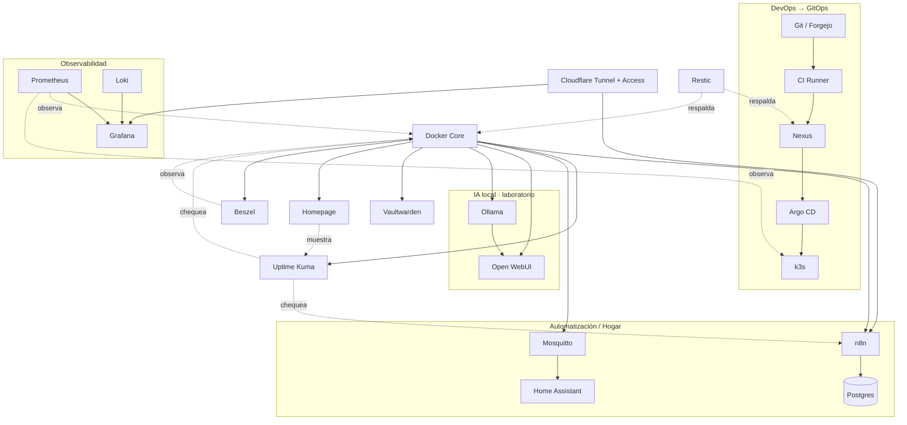

# Catálogo de servicios

La tabla resume el rol previsto. **Objetivo** no significa “instalar ya”: cada servicio entra cuando su fase del roadmap lo requiere.

| Servicio | Estado | Ubicación sugerida | Para qué lo usamos |
|---|---|---|---|
| [Docker y Docker Compose](./docker-compose.md) | **Actual** · Core | VM `core01` | ejecutar n8n, Uptime Kuma, dashboards y utilidades |
| [EasyPanel](./easypanel.md) | Laboratorio · Plataforma de apps | VM Docker dedicada o `core01` durante la etapa inicial | comparar un PaaS casero contra el flujo GitOps; redundante con Compose+k3s si no aporta algo distinto |
| [Sonatype Nexus Repository](./nexus.md) | **Actual** · DevOps | VM `devops01` | proxy/cache de npm y registry Docker privado, usado por el CI real |
| [Forgejo / Git local](./forgejo.md) | **Actual** · DevOps | VM `devops01` | origen real de `oscar-gitops` (ya no mirror), repos privados del homelab, GitOps completamente local |
| [CI Runner](./ci-runner.md) | **Actual** · DevOps (Forgejo Actions) | VM `devops01` | pipeline real validado: lint → test → build → push a Nexus → actualiza GitOps → Argo CD despliega |
| k3s + Traefik | **Actual** · Kubernetes | VM `k3s01` | cluster de un solo nodo, ingress controller para las apps con `*.oscar.home` |
| [Argo CD](./argocd.md) | **Actual** · GitOps | cluster k3s (`k3s01`) | sincroniza `oscar-gitops` (Forgejo) — `root-app`, `oscar-led-controller`, `ci-demo` |
| [Prometheus](./prometheus.md) | Objetivo · Observabilidad | VM observabilidad o k3s, según fase | métricas de hosts |
| [Grafana](./grafana.md) | Objetivo · Observabilidad | VM observabilidad o Docker Core | dashboard de rack |
| [Loki](./loki.md) | Objetivo · Logs | VM observabilidad o k3s | logs de contenedores |
| [Uptime Kuma](./uptime-kuma.md) | **Actual** · Disponibilidad | Docker Core | HTTP checks |
| [n8n](./n8n.md) | **Actual** · Automatización | Docker Core | backups coordinados |
| [Vaultwarden](./vaultwarden.md) | **Actual** · Seguridad | Docker Core | gestor de contraseñas propio (Bitwarden-compatible) |
| [Homepage](./homepage.md) | **Actual** · Dashboard | Docker Core | landing con links/estado de todos los servicios |
| [Beszel](./beszel.md) | **Actual** · Observabilidad | Docker Core | monitoreo liviano de CPU/RAM/disco, alternativa a Prometheus+Grafana |
| [Home Assistant](./home-assistant.md) | **Actual** · Hogar | VM dedicada (vmid 101) | automatización doméstica |
| [ProxMenux Monitor](./proxmenux-monitor.md) | **Actual** · Observabilidad | systemd en `oscar-core` | dashboard de CPU/RAM/disco/red del hipervisor, instalado fuera de Docker |
| [Glances](./glances.md) | **Actual** · Observabilidad | Docker Core | fuente de datos real de CPU/RAM/disco de `core01` para el header de Homepage, con tarjeta y UI propia (procesos, red, contenedores) |
| [MySpeed](./myspeed.md) | **Actual** · Observabilidad | Docker Core | historial de velocidad de internet, tests automáticos |
| [Portainer](./portainer.md) | **Actual** · Infraestructura | Docker Core (server) + `devops01` (agente) | consola de contenedores/logs de `core01`+`devops01` — solo lectura/estado, no reemplaza Git como fuente de la config |
| [Nginx Proxy Manager](./nginx-proxy-manager.md) | **Actual** · Infraestructura | Docker Core | reverse proxy interno para las apps de Docker Compose (Forgejo); las apps de k3s van directo a Traefik, no por acá |
| [Relay SMTP (Brevo)](./smtp-relay.md) | **Actual** · Infraestructura | Docker Core | `boky/postfix` relay-only, para que otros servicios (ej. Vaultwarden) puedan mandar mail sin exponer credenciales SMTP reales a cada uno |
| [Cloudflare Tunnel + Access](./cloudflare-tunnel.md) | **Actual** · Acceso remoto | Docker Core | publica Vaultwarden/n8n/Kuma/Homepage/Beszel/ProxMenux Monitor/Home Assistant sin abrir puertos, cada uno con Access delante (7 hostnames reales) |
| [Eclipse Mosquitto MQTT](./mosquitto.md) | Laboratorio / Hogar | Raspberry Pi o VM Core | sensores Pi Zero |
| [Ollama](./ollama.md) | Laboratorio · IA local | Dell/VM solo para modelos compatibles con recursos; hardware futuro para cargas mayores | probar LLM local |
| [Open WebUI](./open-webui.md) | Laboratorio · IA | Docker Core conectado a proveedor/modelo permitido | UI para Ollama |
| [Restic](./restic.md) | Objetivo · Backup | clientes/VMs que necesiten backup de archivos | backup de configs |
| [MinIO](./minio.md) | Laboratorio · Object Storage | VM/storage de laboratorio | aprender API S3 |

## Mapa de dependencias

Flechas sólidas = "necesita para funcionar"; punteadas = "observa/respalda sin ser una dependencia dura" (el servicio observado sigue funcionando si Prometheus o Restic están caídos, al revés no). EasyPanel y MinIO quedan fuera del mapa a propósito: son laboratorios independientes, sin integrarse todavía al resto.

## Criterio de adopción

Antes de sumar un servicio, responder:

1. ¿qué problema real resuelve?
2. ¿ya tenemos otro servicio que resuelve lo mismo?
3. ¿qué datos persistirá?
4. ¿qué backup necesita?
5. ¿cómo sabremos que está sano?
6. ¿qué dependencia nueva introduce?
7. ¿podemos destruirlo y reconstruirlo desde Git?

El objetivo no es maximizar la cantidad de logos del dashboard; es maximizar lo que aprendemos y lo fácil que resulta operar el conjunto.

## Candidatos evaluados, no decididos todavía

Investigación de qué más tendría sentido traer al homelab (disparada por un repaso de [railway.app/templates](https://railway.com/templates) — la mayoría de lo que ahí aparece es tooling de desarrollo específico de Railway, no aplicable acá; esta lista es más amplia que solo lo que aparece ahí). Es una lista de **candidatos para evaluar**, no un compromiso de implementación — pasan por el mismo [criterio de adopción](#criterio-de-adopción) de arriba antes de instalarse.

Ya contemplado en otro lado, **no repetido acá** para no duplicar: `MinIO` (S3, ya en la tabla de arriba como Laboratorio), `Paperless-ngx` y `Karakeep` (gestión documental / bookmarking, ya en `OSCAR_TARGET_ARCHITECTURE.md` sección 24, "apps en evaluación").

| App | Qué hace | Necesidad real / qué reemplazaría | Esfuerzo | Dónde |
|---|---|---|---|---|
| [Docuseal](https://www.docuseal.com/) | Firma electrónica de documentos (PDF/Word), campos drag-and-drop, plantillas, auditoría | Alternativa a DocuSign/HelloSign — firmar sin depender de un tercero | Medio — 3 servicios (app + Postgres + Redis) | k3s, `oscar-tools` |
| [Nextcloud](https://nextcloud.com/) | Sync/share de archivos, calendario, contactos, edición colaborativa | Reemplaza Google Drive/Dropbox — el único candidato de esta lista con volumen de datos real y creciente | Alto — PHP+DB+caché, más pesado que el resto de esta lista junta | Docker Compose, `core01` (o VM propia si crece) |
| [Garage](https://garagehq.deuxfleurs.fr/) | Storage S3-compatible, pensado para clusters chicos/homelab (Rust, footprint bajo) | Responde lo mismo que MinIO pero sin el peso de MinIO — vale compararlos antes de elegir cuál de los dos, no los dos | Bajo | Docker Compose, `core01` |
| [Immich](https://immich.app/) | Backup y gestión de fotos/videos desde el celular, reconocimiento facial/de objetos | Alternativa a Google Photos — la más pedida en general en homelabs personales | Medio-alto — ML de por medio (reconocimiento), I/O de fotos crece rápido | Docker Compose, `core01` (o `devops01` si `core01` queda justo) |
| [Jellyfin](https://jellyfin.org/) | Servidor de streaming de música/películas/series | Media server propio, sin depender de un servicio de streaming de terceros | Medio — liviano en reposo, transcodificar video en vivo sí pesa | Docker Compose |
| [Trilium Notes](https://github.com/zadam/trilium) | Notas jerárquicas tipo wiki personal, con versionado | Base de conocimiento personal — runbooks/notas propias que hoy no tienen un lugar fijo | Bajo | Docker Compose |
| [Firefly III](https://www.firefly-iii.org/) | Finanzas personales — presupuesto, categorización de gastos, reportes | Ninguna herramienta hoy cubre esto | Bajo-medio — app + DB | Docker Compose |
| [Vikunja](https://vikunja.io/) | Gestión de tareas/proyectos (tipo Todoist/Trello) | Complementa a n8n (automatización) sin superponerse — Vikunja es para tareas humanas, n8n para workflows | Bajo | Docker Compose o k3s `oscar-tools` |
| [Linkding](https://github.com/sissbruecker/linkding) | Gestor de bookmarks, minimalista | Si `Karakeep` (ya en evaluación) resulta pesado, esta es la alternativa liviana al mismo problema — no desplegar los dos | Muy bajo | k3s, `oscar-tools` |

**Criterio de adopción aplicado a las tres más fuertes** (las que el usuario recordaba específicamente + la más pedida en general):

- **Docuseal** — (1) firmar documentos sin depender de un SaaS de terceros; (2) nada hoy resuelve esto; (3) PDFs/Word originales + metadata de firmas en Postgres — dato real, no recreable si se pierde; (4) sí, backup de Postgres + del volumen de documentos, mismo criterio que cualquier servicio con estado real (ver [estrategia 3-2-1](../backup-dr/estrategia-321.md)); (5) healthcheck HTTP simple; (6) Postgres + Redis nuevos si no se reusan los que ya corren en `core01`/`k3s`; (7) sí, stateless en config — el estado real (documentos firmados) necesita su propio backup, no alcanza con reconstruir desde Git.
- **Nextcloud** — (1) sync/share de archivos sin depender de Google/Dropbox; (2) nada hoy resuelve esto — es el hueco más real de la lista; (3) archivos de usuario reales, potencialmente mucho volumen, crece sin techo claro; (4) sí, y es el más importante de toda la lista — perder esto es perder archivos personales reales, no una config reconstruible; (5) healthcheck HTTP + espacio en disco disponible; (6) PHP+DB+caché, la pieza más pesada de mantener actualizada de toda la lista; (7) no del todo — la config sí, los archivos de usuario no, por diseño (son el objetivo del servicio, no un efecto secundario).
- **Immich** — (1) backup de fotos del celular sin depender de Google Photos; (2) nada hoy resuelve esto; (3) fotos/videos originales — volumen que solo crece, nunca se reduce; (4) sí, mismo peso que Nextcloud — es contenido irreemplazable; (5) healthcheck HTTP + job de sync corriendo; (6) base de datos + motor de ML para reconocimiento (contenedor aparte, más pesado que el resto); (7) config sí, las fotos no — mismo caso que Nextcloud.

El patrón se repite: las tres opciones con más valor real (Docuseal, Nextcloud, Immich) son también las tres con datos de usuario genuinos e irreemplazables — a diferencia de casi todo lo demás en este catálogo, que es reconstruible desde Git. Antes de instalar cualquiera de las tres, la estrategia de backup off-site (todavía pendiente, ver [estado actual](../arquitectura/estado-actual.md#backups--parcialmente-resuelto)) deja de ser "sería bueno tenerla" y pasa a ser un requisito real.

Minecraft y Counter-Strike 2 no están en esta tabla a propósito: no son servicios de infraestructura, viven en su propia sección — ver [servidores de juegos](../juegos/vision-general.md).
