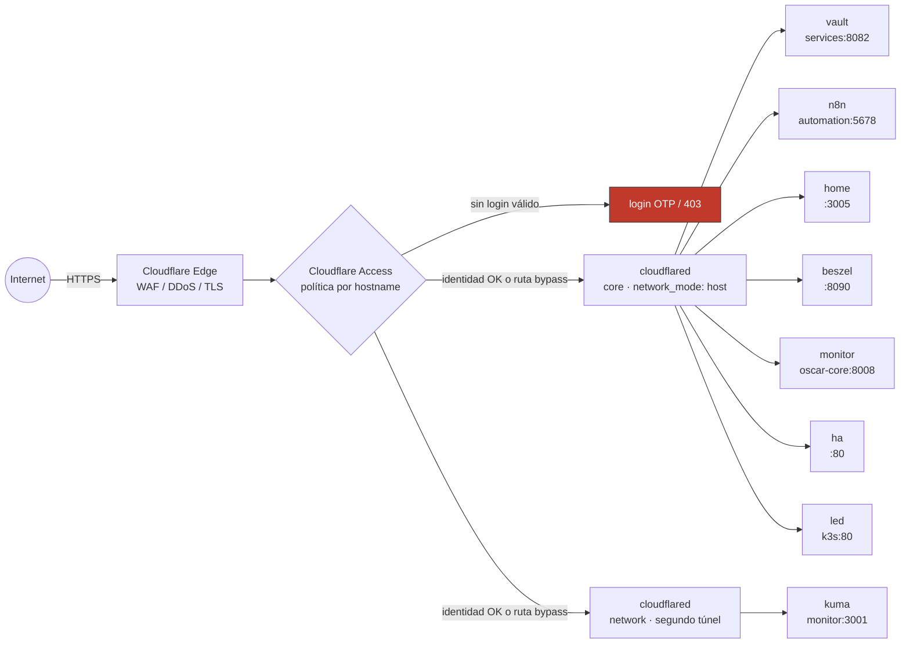
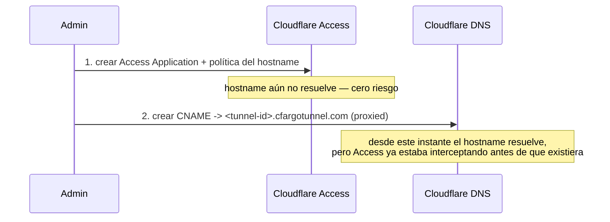

# Cloudflare Tunnel + Access

**Estado:** Actual — dos túneles corriendo y conectados: `core` (7 hostnames) y `pinode01` (1 hostname, `kuma`, movido acá el 2026-09-23 para que sobreviva a un cuelgue del Dell — ver [abajo](#segundo-túnel-pinode01-con-uso-real-2026-09-23)). Cloudflare Access habilitado con una Access Application + política por servicio (solo el email del autor, código de un solo uso), los 8 registros DNS ya publicados y protegidos
**Dónde corre:** `core` (`/srv/oscar/apps/cloudflared/`), `network_mode: host`
**Sizing inicial:** muy bajo (~20-30 MB RAM)
**Red/puertos:** solo conexiones salientes (QUIC/HTTP2 hacia el edge de Cloudflare); ningún puerto inbound en el router
**Persistencia:** el token del túnel (`TUNNEL_TOKEN` en `.env`) — la configuración de ingress vive en Cloudflare (`config_src: cloudflare`), no en un `config.yml` local

## Rol dentro de O.S.C.A.R.

- publicar Vaultwarden, n8n, Uptime Kuma, Homepage y Beszel sin abrir puertos ni depender de certificados self-signed
- reemplaza el intento anterior con Caddy + `tls internal` para Vaultwarden, que nunca terminó de funcionar bien en el navegador
- acceder con identidad (Cloudflare Access) en vez de VPN para lo administrativo

## Arquitectura

El único tramo de red real hacia afuera es `cloudflared` iniciando la conexión saliente hacia el edge (QUIC/HTTP2) — las flechas de arriba representan el camino lógico de un request, no que exista un puerto escuchando en `core` hacia Internet.

## Estado real del despliegue

`network_mode: host` es deliberado (mismo criterio que [Beszel](./beszel.md)): así el túnel llega a cada servicio vía `http://localhost:<puerto>` sin importar en qué red Docker viva cada compose por separado.

Ingress del túnel `core` (vía API, `config_src: cloudflare`) — **ya no incluye `kuma`**, ver la sección de abajo:

| Hostname | Servicio interno |
|---|---|
| `vault.oscarlab.com.ar` | `http://192.168.0.154:8082` — Vaultwarden, migrado a `services` |
| `n8n.oscarlab.com.ar` | `http://192.168.0.153:5678` — migrado a `automation` |
| `home.oscarlab.com.ar` | `http://localhost:3005` |
| `beszel.oscarlab.com.ar` | `http://localhost:8090` |
| `monitor.oscarlab.com.ar` | `http://192.168.0.233:8008` — [ProxMenux Monitor](./proxmenux-monitor.md), corre en `oscar-core` (el hipervisor), no en `core` (la VM) |
| `ha.oscarlab.com.ar` | `http://192.168.0.195:80` — [Home Assistant](./home-assistant.md), VM 106 |
| `led.oscarlab.com.ar` | `http://192.168.0.150:80` (`httpHostHeader: led.oscar.home`) — Ingress de Traefik en `k3s` |
| *(catch-all)* | `http_status:404` |

## Segundo túnel: `pinode01`, con uso real (2026-09-23)

Existía un segundo túnel registrado en Cloudflare, `pinode01` (el nombre quedó del host antes de renombrarse a [`network`](../hardware/network.md)), con su propio `cloudflared` corriendo ahí desde el 21/9 pero **sin ninguna regla de ingress** (`config: null`) — un hallazgo de la migración de Kuma: el DNS de `kuma.oscarlab.com.ar` había estado apuntando todo este tiempo al túnel de `core`, proxeando por LAN, no a este túnel dedicado (ver [Uptime Kuma](./uptime-kuma.md)).

**Por qué importa tenerlo separado:** con `cloudflared` de `core` corriendo en el mismo host que tuvo 3 cuelgues reales de NIC (el último tumbando el host entero, ver [estado actual](../arquitectura/estado-actual.md)), cualquier hostname público que dependa de ese túnel se cae junto con el Dell — aunque el servicio en sí (Kuma, en `monitor`) siga sano. Mover `kuma` a un túnel con conector en una Raspberry Pi separada la hace sobrevivir a un cuelgue del Dell.

**Cambio hecho:** ingress nuevo en el túnel `pinode01` (`kuma.oscarlab.com.ar` → `http://192.168.0.214:3001`, proxeando por LAN a `monitor`, más el catch-all `http_status:404` obligatorio), el registro DNS de `kuma.oscarlab.com.ar` repuntado (`CNAME` al nuevo `tunnel-id.cfargotunnel.com`), y recién después la entrada vieja borrada del ingress de `core` — en ese orden, para no dejar una ventana sin servir el hostname. Verificado con los 8 hostnames públicos respondiendo `302` (Access) antes y después del corte.

Orden que se siguió (importa para no dejar una ventana pública sin protección): primero se creó la Access Application + política de cada hostname, y **recién después** el registro DNS (`CNAME` → `<tunnel-id>.cfargotunnel.com`, `proxied: true`) — así, en el instante exacto en que cada hostname empezó a resolver, Access ya estaba interceptando. Crear el DNS antes que la política habría dejado el servicio público sin nada delante durante esa ventana.

Cada Access Application usa el método de login por defecto de Cloudflare (código de un solo uso enviado por email) — no hizo falta configurar ningún proveedor de identidad externo, alcanza con la política `include: email == <el único usuario real>`.

Pendiente real: **`kuma.oscarlab.com.ar` y `home.oscarlab.com.ar`** quedaron con la misma política restrictiva que el resto por prolijidad, pero son candidatos a relajar más adelante si se quiere una página de estado o un dashboard público sin login — evaluarlo caso por caso, no por defecto.

**Gap detectado (pendiente de resolver):** [exposición a Internet](../seguridad/exposicion-internet.md) y [n8n](./n8n.md) dan por sentado que los webhooks de n8n se publican "por endpoint específico, no por la UI completa" — el mismo patrón de bypass que ya existe para Vaultwarden. Hoy `n8n.oscarlab.com.ar` no tiene ningún bypass documentado en la tabla de arriba: si Access protege todo el hostname, un webhook entrante (Alertmanager, GitHub, etc.) no puede completar el login OTP interactivo y quedaría bloqueado. Falta crear una Access Application anclada a la ruta de webhooks de n8n (`/webhook/*` o la que corresponda) con `decision: bypass`, igual que se hizo con `/identity`/`/api`/`/notifications`/`/icons`/`/alive` en Vaultwarden — o confirmar que ningún workflow depende hoy de un webhook público real, en cuyo caso corresponde ajustar la redacción de `exposicion-internet.md` en vez del Tunnel.

### Rutas con bypass (Vaultwarden)

Access protege todo `vault.oscarlab.com.ar` por defecto, pero eso rompe a los clientes que no saben hacer el login web de Cloudflare (extensión/apps oficiales de Bitwarden, Uptime Kuma chequeando el endpoint de salud). Se crearon Access Applications adicionales, ancladas a subrutas específicas, con política `decision: bypass` (sin pedir login) — Vaultwarden ya tiene su propia autenticación fuerte en esas rutas, así que el bypass no baja la seguridad real del vault:

| Ruta con bypass | Para qué |
|---|---|
| `/identity` | login de la extensión/apps oficiales y del CLI (`client_id`/`client_secret`) |
| `/api` | sincronización del vault |
| `/notifications` | websocket de sync en vivo |
| `/icons` | favicons de sitios guardados, no sensible |
| `/alive` | healthcheck liviano usado por [Uptime Kuma](./uptime-kuma.md) |

El resto de `vault.oscarlab.com.ar` (la interfaz web y `/admin`) sigue exigiendo el login de Access normal.

## Ejemplo concreto

`vault.oscarlab.com.ar` → Cloudflare Access (MFA) → Tunnel → Vaultwarden interno.

## Checklist de despliegue

- [ ] hostname y ubicación decididos;
- [ ] imagen/versión fijada, evitando tags flotantes en servicios importantes;
- [ ] puertos documentados;
- [ ] volumen/persistencia definida;
- [ ] `.env.example` sin secretos en Git;
- [ ] credenciales reales fuera de Git;
- [ ] backup definido antes de cargar datos importantes;
- [ ] healthcheck o monitor de disponibilidad;
- [ ] métricas/logs incorporados cuando sea razonable;
- [ ] procedimiento de actualización y rollback documentado.

## Seguridad

Tunnel no convierte automáticamente un servicio en privado. Agregar Access/políticas cuando el hostname no deba ser público.

Como baseline:

- no publicar el panel administrativo directamente a Internet;
- usar usuario no-root dentro del contenedor cuando la imagen lo soporte;
- limitar redes y puertos a lo necesario;
- revisar mounts privilegiados;
- separar secretos de la configuración versionada.

## Backup y restore

El servicio en sí es prácticamente stateless. Lo único que hay que respaldar son dos archivos pequeños pero críticos:

- el JSON de credenciales del túnel (`<tunnel-id>.json`) — es un secreto, nunca en el mismo repo Git en texto plano, tratarlo como cualquier otro secreto;
- `config.yml` (reglas de ingress) — sí puede versionarse en Git si no contiene secretos.

Las políticas de Cloudflare Access (identidad, MFA, reglas de quién entra a qué) viven en el dashboard de Cloudflare, no en el host. Hoy no hay backup/export automatizado de esas políticas; queda pendiente resolver esto más adelante, por ejemplo exportándolas vía API/Terraform si se adopta IaC de Cloudflare.

Restore: recrear el túnel desde cero con `cloudflared tunnel create` es rápido si se pierden las credenciales (hay que volver a autorizar DNS). El riesgo real no es "perder el túnel" sino perder la definición de las políticas de Access sin tener dónde reconstruirlas rápido.

## Observabilidad

- estado de la conexión del daemon `cloudflared` (métricas locales en `/metrics`, o el dashboard de Cloudflare Zero Trust);
- latencia agregada reportada por Cloudflare;
- certificado/DNS del hostname público;
- reinicios del proceso/contenedor del daemon;
- logs de errores de conexión del túnel.

## Troubleshooting

- **El hostname público no responde pero el servicio local sí** → túnel caído o DNS mal apuntado en Cloudflare → `cloudflared tunnel info <tunnel>`, revisar logs del daemon; ver [DNS caído](../runbooks/dns-caido.md) si el problema es de resolución.
- **Cloudflare Access no pide autenticación (o rechaza a todos)** → política mal configurada o cambiada manualmente en el dashboard sin registro → revisar la política en Zero Trust → Access, comparar contra la última configuración conocida.
- **El daemon `cloudflared` reinicia en loop** → credenciales del túnel inválidas o revocadas → ver [Servicio Docker caído](../runbooks/docker-servicio-caido.md), regenerar credenciales con `cloudflared tunnel create` si corresponde.

## Ideas de laboratorio

1. desplegar una instancia de prueba;
2. cargar datos ficticios;
3. provocar una caída controlada;
4. detectar la caída desde Uptime Kuma/Prometheus;
5. restaurar o hacer rollback;
6. registrar el procedimiento en un runbook.

## Documentación oficial

https://developers.cloudflare.com/cloudflare-one/connections/connect-networks/
