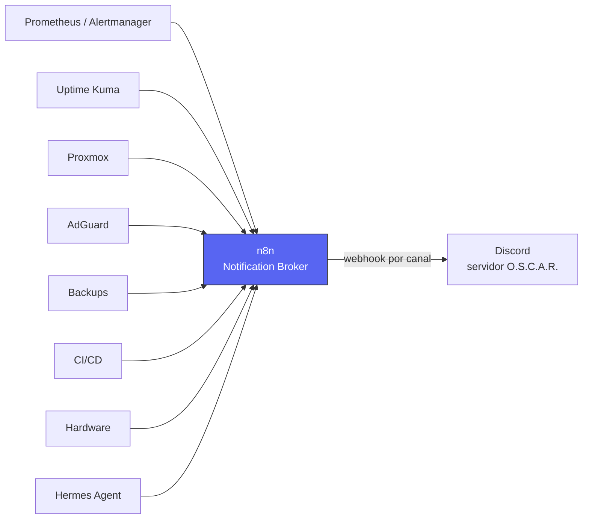
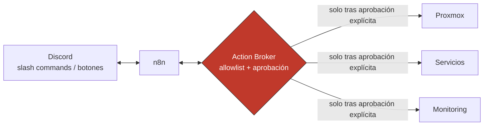

# Discord

**Estado:** Fase 1 en producción (2026-10-03) — servidor y bot creados, estructura de categorías/canales gestionada como IaC (`setup-oscar-discord.sh` + `discord-channels.json`, raíz del repo). El Notification Broker corre como un único workflow real en n8n (**"OSCAR - Discord Notification Broker"**), con las 12 ramas (una por canal) activas y probadas de punta a punta. Alertmanager ya tiene un receiver real apuntando a él; Uptime Kuma se conecta igual, vía su notificación tipo Webhook (paso manual de configuración, no versionado).
**Dónde corre:** el bot vive en la infraestructura de Discord (no hay proceso propio que mantener); lo único que corre en OSCAR es el workflow de n8n que consume los webhooks (`core`, ver [n8n](./n8n.md)).
**Persistencia:** el bot token y el Guild ID son secretos/configuración — nunca en Git, ver [Variables de entorno](#variables-de-entorno).

## Rol dentro de O.S.C.A.R.

Discord es el canal de salida de notificaciones y, a futuro, de interacción operativa con OSCAR — **nunca** el punto de entrada directo de ninguna herramienta de monitoreo o infraestructura.

```text
Prometheus, Alertmanager, Uptime Kuma, Proxmox, AdGuard,
Backups, CI/CD, Hardware, Hermes Agent
        │
        ▼
       n8n   ← único componente que conoce y usa las URLs de los webhooks de Discord
        │
        ▼
     Discord
```

Esto es deliberado, no una limitación temporal: integrar cada herramienta directo contra un webhook de Discord multiplicaría la lógica de formato/severidad/ruteo por cada fuente, y dejaría esa lógica fuera de control de versiones. Centralizarla en n8n significa un solo lugar donde cambiar el formato de un mensaje, agregar deduplicación, o cambiar de proveedor de chat el día de mañana.

**Fuera de alcance de esta fase (documentado, no implementado):** una capa bidireccional Discord ↔ n8n ↔ *Action Broker* ↔ Proxmox/Monitoring/Servicios, donde un comando o botón en Discord puede disparar una acción real. Si se construye, debe seguir el mismo principio que ya rige a Hermes Agent (ver el spec `OSCAR_HERMES_AGENT_SPEC.md`, raíz del repo, §22-23 y §32-35): `OBSERVE → UNDERSTAND → SUGGEST → ASK FOR APPROVAL → ACT`, nunca ejecución automática a partir de una respuesta generada por IA.

## Arquitectura

### Fase 1 (esto) — solo notificación, un solo sentido



Ninguna de las fuentes de arriba tiene, ni debe tener, un webhook de Discord configurado directamente — todas pasan por n8n.

### Fase futura (no implementada) — interacción bidireccional con aprobación humana



Esta capa reutiliza el patrón de `n8n como Action Broker` ya definido para Hermes Agent (`OSCAR_HERMES_AGENT_SPEC.md`, §22) — no se diseña un segundo patrón de aprobación en paralelo.

## Discord Application y bot

1. Crear la Application en https://discord.com/developers/applications (ya hecho: "O.S.C.A.R.").
2. Dentro de la Application, agregar un Bot.
3. En **Bot → Privileged Gateway Intents**: no se necesita ningún intent privilegiado para webhooks/notificaciones (el bot no lee mensajes de usuarios en esta fase).
4. Copiar el **Bot Token** una sola vez al generarlo — no se puede volver a ver, solo regenerar. Tratarlo como cualquier otro secreto (ver [Variables de entorno](#variables-de-entorno)).

### Permisos mínimos

El bot se usa únicamente para gestionar la estructura de categorías/canales (`setup-oscar-discord.sh`) y, a futuro, leer/crear webhooks. Nunca necesita `Administrator`.

Permisos reales usados por el bitfield de la invitación:

| Permiso | Para qué |
|---|---|
| `View Channels` | leer la estructura actual del servidor |
| `Manage Channels` | crear/borrar categorías y canales (`setup-oscar-discord.sh`) |
| `Manage Webhooks` | crear webhooks por canal (fase 1, manual por ahora — ver [Webhooks](#webhooks)) |
| `Send Messages` + `Embed Links` | para cuando el bot mismo publique mensajes (no solo webhooks), fase futura |

Si en algún momento se necesita un permiso adicional, se documenta acá con su justificación — nunca se otorga `Administrator` "por las dudas".

### Instalar el bot en el servidor

Generar el link de invitación desde **OAuth2 → URL Generator**, con scope `bot` y los permisos de la tabla anterior, y abrirlo una vez para agregar el bot al servidor "O.S.C.A.R." (ya hecho).

### Obtener el Guild ID

Discord → Ajustes de usuario → Avanzado → activar **Modo de desarrollador** → clic derecho sobre el servidor → **Copiar ID del servidor**.

## Variables de entorno

```dotenv
DISCORD_BOT_TOKEN=CHANGE_ME
DISCORD_GUILD_ID=CHANGE_ME
```

**Nunca** se commitea el `.env` real ni se pega el valor real en documentación, logs, mensajes de commit o salida de este script. `setup-oscar-discord.sh` solo imprime nombres de recursos (categorías, canales), nunca el token ni ningún header de autenticación — ver [Seguridad](#seguridad).

Mismo patrón que el resto del repo (ver [Gestión de secretos](../seguridad/secretos.md)): variables `CHANGE_ME` en documentación/ejemplo, valores reales solo en el entorno donde se ejecuta el script, nunca en Git.

## `setup-oscar-discord.sh`

La estructura de categorías/canales es declarativa: vive en `discord-channels.json` (raíz del repo), y el script la reconcilia contra el servidor real.

```bash
export DISCORD_BOT_TOKEN="..."
export DISCORD_GUILD_ID="..."

./setup-oscar-discord.sh               # crea lo que falte. Nunca borra nada.
./setup-oscar-discord.sh --dry-run     # muestra CREATE/KEEP sin tocar el servidor
./setup-oscar-discord.sh --cleanup             # además borra lo no declarado
./setup-oscar-discord.sh --cleanup --dry-run   # muestra también DELETE, sin borrar nada
```

- **Modo normal**: idempotente — si una categoría/canal ya existe (por nombre, y para canales también por categoría padre), no hace nada; si falta, lo crea.
- **`--dry-run`**: solo hace lecturas (`GET`) contra la API de Discord, nunca `POST`/`DELETE`. Imprime `CREATE`/`KEEP` por cada categoría y canal declarado.
- **`--cleanup`**: comportamiento destructivo, **requiere este flag explícito** — sin él, el script jamás borra nada, ni siquiera canales que ya no están en `discord-channels.json` (por ejemplo, el viejo `#oscar-agent` tras el renombre a `#hermes-agent`, ver [Estructura de canales](#estructura-de-categorías-y-canales)). Borra categorías y canales de texto o voz que existan en el servidor pero no estén declarados en el JSON — incluye cualquier canal de voz, ya que la estructura declarada hoy no define ninguno.
- **`--cleanup --dry-run`**: combina ambos — corre el mismo diff que `--cleanup` pero imprime `DELETE` en vez de ejecutar el borrado.

### Manejo de rate limit (HTTP 429)

Ya se encontró este caso en la práctica durante el primer bootstrap. Cada llamada a la API pasa por un wrapper único (`discord_api()`) que:

1. captura el código HTTP y el body por separado;
2. si el código es `429`, lee `retry_after` del body (segundos, puede ser fraccional), espera esa cantidad más un margen pequeño, y reintenta — hasta 5 veces;
3. si se agotan los reintentos, o el error es otro (4xx/5xx que no sea rate limit), se reporta con el body completo de Discord y se aborta solo ese paso, no todo el bootstrap.

No son sleeps arbitrarios: el tiempo de espera lo informa Discord en cada respuesta 429, no un valor fijo adivinado.

## Estructura de categorías y canales

Definida en `discord-channels.json`:

| Categoría | Canales | Uso |
|---|---|---|
| 📡 STATUS | `#status`, `#alerts`, `#incidents` | estado general, alertas operativas, seguimiento de incidentes |
| 🖥️ INFRASTRUCTURE | `#proxmox`, `#network`, `#raspberry-pi` | eventos de Proxmox/oscar-core, red/DNS/AdGuard, Raspberry Pi |
| 🚀 OPERATIONS | `#deployments`, `#backups`, `#automation` | deployments, backups, workflows de n8n |
| 🔐 SECURITY | `#security-alerts` | eventos de seguridad |
| 🤖 O.S.C.A.R. | `#hermes-agent`, `#activity` | interacción con Hermes Agent, actividad general |

**Nota de renombre:** el canal se llama `#hermes-agent`, no `#oscar-agent`. El agente de IA de OSCAR ya tiene nombre propio y spec detallada — Hermes Agent (`OSCAR_HERMES_AGENT_SPEC.md`, raíz del repo) — así que el canal se alinea con ese nombre en vez de introducir un segundo nombre para el mismo concepto. El canal `#oscar-agent`, creado en un bootstrap anterior a esta decisión, queda huérfano hasta correr `./setup-oscar-discord.sh --cleanup` (revisar primero con `--cleanup --dry-run`).

## Webhooks

Cada canal que va a recibir notificaciones necesita su propio webhook de Discord. Un webhook de Discord **es un secreto** (su URL incluye un token) — por eso, a diferencia de categorías/canales, esta fase no automatiza su creación/distribución desde el script: habría que imprimir o persistir ese secreto en algún lado, lo cual viola la regla de "nunca imprimir tokens en logs". Se crea a mano, una vez por canal:

1. Canal → **Editar canal** → **Integraciones** → **Webhooks** → **Nuevo webhook**.
2. Copiar la URL del webhook.
3. Pegarla como credencial en n8n (nunca en Git, nunca en este repo) — ver [n8n](./n8n.md).

**n8n es el único componente que conoce estas URLs.** Ninguna fuente de eventos (Prometheus, Alertmanager, Kuma, Proxmox, etc.) tiene ni debe tener un webhook de Discord configurado directamente.

Automatizar la creación/rotación de webhooks desde `setup-oscar-discord.sh`, guardando cada URL directamente como credencial en n8n vía su API, queda como mejora futura — no se construye en esta fase para no ampliar el alcance alrededor de un secreto nuevo.

## Integración con n8n — diseño del Notification Broker

### Por qué n8n y no las herramientas directo

Cada fuente de eventos conoce su propio formato (una regla de Alertmanager no es un evento de Proxmox no es un resultado de backup). Si cada una tuviera su propio webhook de Discord, la lógica de severidad/formato/ruteo/deduplicación se repetiría — y divergiría — en cada integración. n8n normaliza todo a un evento interno único antes de decidir a qué canal va y con qué formato.

### Gap de red conocido: Cloudflare Access

`n8n.oscarlab.com.ar` está detrás de Cloudflare Access (login OTP) sin ruta de bypass para webhooks (ver [n8n](./n8n.md#seguridad) y [Cloudflare Tunnel + Access](./cloudflare-tunnel.md)). **Para esta fase**, las fuentes de eventos llaman al webhook de n8n por su dirección LAN (`http://192.168.0.153:5678/webhook/...`), no por el hostname público — así no dependen de Access. Esto es intencional y no bloquea nada porque todas las fuentes actuales (Prometheus, Alertmanager, Proxmox, CI/CD) ya corren dentro de la LAN. El día que una fuente externa necesite enviar eventos, hay que resolver el bypass de Access para esa ruta específica (mismo patrón ya usado en Vaultwarden, `/identity`/`/api`/etc. con `decision: bypass`) antes de depender del hostname público.

### Evento interno normalizado

Toda fuente, al llegar a n8n, se traduce a una forma común antes de decidir ruteo/formato:

```json
{
  "source": "proxmox",
  "type": "proxmox.vm.stopped",
  "severity": "warning",
  "host": "oscar-core",
  "summary": "VM core01 se detuvo inesperadamente",
  "detail": { "vmid": 100, "node": "oscar-core" },
  "detected_at": "2026-10-03T10:15:00-03:00",
  "correlation_key": "proxmox:core01:stopped"
}
```

`severity` usa el esquema interno de 3 niveles (`info`/`warning`/`critical`, igual que [alertas.md](../observabilidad/alertas.md)) — el mapeo a los 7 niveles de presentación de Discord ocurre recién al armar el mensaje, no antes (ver [Severidades](#severidades)).

### Pipeline del broker (nodos conceptuales en n8n)

```text
Webhook (por fuente o genérico)
  → Normalizar a evento interno (forma de arriba)
  → Deduplicar (correlation_key + ventana de tiempo — no repetir el mismo evento cada vez que la fuente reintenta)
  → Throttle (máximo N mensajes por canal por minuto — evitar que un flapping inunde Discord)
  → Enriquecer (agregar contexto: ¿hay un incidente abierto con esta correlation_key? ¿es una recuperación de algo que estaba caído?)
  → Mapear severidad (3 → 7, ver tabla abajo)
  → Rutear (type → canal, ver tabla abajo)
  → Formatear (texto simple o embed, ver Ejemplos)
  → Enviar al webhook de Discord del canal correspondiente
```

**Correlación de incidentes:** si llega un evento con el mismo `correlation_key` que uno ya enviado y todavía no resuelto, no se manda un mensaje nuevo — se actualiza/responde al mensaje existente (o se agrupa) en vez de duplicar. Si después llega un evento de recuperación con el mismo `correlation_key`, se envía como `RECOVERY`, no como un `INFO` desconectado del incidente original.

**Agrupamiento:** eventos de baja severidad y alta frecuencia (ej. varios `info` del mismo host en poco tiempo) se agrupan en un solo mensaje resumen en vez de uno por evento — mantiene el canal legible.

### Tabla de ruteo

| Tipo de evento | Canal |
|---|---|
| `system.status.*` | `#status` |
| `alert.*` | `#alerts` |
| `incident.*` | `#incidents` |
| `proxmox.*` | `#proxmox` |
| `network.*` | `#network` |
| `raspberry.*` | `#raspberry-pi` |
| `deployment.*` | `#deployments` |
| `backup.*` | `#backups` |
| `automation.*` | `#automation` |
| `security.*` | `#security-alerts` |
| `hermes.agent.*` | `#hermes-agent` |
| `hermes.activity.*` / `oscar.activity.*` | `#activity` |

No es un contrato rígido — el `type` de cada evento puede extenderse, pero la separación conceptual por canal se mantiene.

### Severidades

**Esquema interno (fuente de verdad, [alertas.md](../observabilidad/alertas.md)):** `info` / `warning` / `critical`.

**Esquema de presentación en Discord (7 niveles):** no reemplaza al interno — es la capa que n8n aplica al formatear un mensaje, porque Discord necesita distinguir también *eventos operativos sin alerta* (un deploy que salió bien, una recuperación) que el esquema de 3 niveles no estaba pensado para describir.

| Interno | Contexto del evento | Discord | Emoji |
|---|---|---|---|
| — | operación exitosa (deploy, backup, automatización) | `SUCCESS` | 🟢 |
| `info` | informativo, sin acción requerida | `INFO` | 🔵 |
| `warning` | degradación parcial, no crítica todavía | `DEGRADED` | 🟠 |
| `warning` | requiere acción planificable | `WARNING` | 🟡 |
| `critical` | servicio esencial caído o riesgo de pérdida de datos | `CRITICAL` | 🔴 |
| — | un incidente/alerta previo se resolvió | `RECOVERY` | ✅ |
| — | una operación (deploy, backup, automatización) falló | `FAILED` | ❌ |

`warning` se bifurca en `DEGRADED`/`WARNING` según si ya hay impacto parcial visible o es todavía preventivo — una decisión del enriquecimiento del broker, no del origen del evento. `SUCCESS`/`FAILED`/`RECOVERY` no vienen de una severidad interna: son el resultado (éxito/fallo/resolución) de una operación u incidente, calculado por el broker a partir de si el evento es un cierre o un disparo.

### Ejemplos de mensajes

**Por qué no hay una grilla de campos separados (fields de Discord):** se intentó armar los `fields` del embed de forma dinámica, con una cantidad variable según el evento — Discord rechaza el mensaje **completo** si algún campo de esa lista queda con nombre o valor inválido, y no hay forma confiable de armar esa lista dinámica por API sin arriesgarse a perder mensajes reales (se probó con nombre fijo, con nombre invisible y con nombre visible — en los tres casos los campos no se renderizaban). Verificado también que la API de Discord no devuelve el contenido de los embeds de mensajes de webhook, así que cualquier chequeo teniendo que confiar en la captura de pantalla del canal real. Se descartó esa vía: **todo el detalle va dentro de la descripción del embed** (soporta Markdown — negrita, saltos de línea), que sí es 100% confiable.

Cada tipo de evento tiene su propio nodo `Code` de formateo en el workflow, pero todos terminan en la misma forma de salida (`title`, `color`, `description`, `timestamp`) que consume el nodo de Discord correspondiente.

**Caída/recuperación de servicio (Uptime Kuma → `#status`):**

```text
🔴 Grafana (monitor) caído
Servicio caído, requiere atención
hoy a las 09:17
```

**Alerta de Alertmanager (→ `#alerts`):** el formateador vuelca automáticamente todas las labels/annotations de la alerta que no sean `alertname`/`severity`/`instance`/`summary`/`description` (ya usadas en el título) como líneas adicionales — una regla nueva con labels propias aparece sin tocar el workflow.

**Evento genérico con severidad + detalle libre (cualquier canal, vía el webhook de esa fuente):**

```json
{ "severity": "degraded", "summary": "Uso de CPU alto sostenido", "host": "oscar-core",
  "detail": { "CPU actual": "92%", "Umbral recomendado": "menor a 80%" } }
```
```text
🟠 DEGRADED · Uso de CPU alto sostenido
Host oscar-core
Acción Revisar el consumo o la carga
CPU actual 92%
Umbral recomendado menor a 80%
```

**Métrica con barra (CPU/RAM/disco — mismo webhook genérico, con `metric`/`value_pct`):**

```json
{ "metric": "CPU", "value_pct": 92, "threshold_pct": 80, "host": "oscar-core" }
```
```text
🟠 CPU alto · oscar-core
CPU  ██████████████████░░  92%   umbral 80%
```

**Deploy (`#deployments`), con pasos:**

```text
🟢 Deploy de homepage-dashboard completado
16:40  build  ok
16:41  push  ok
16:42  restart  ok
Versión: a1b2c3d → e4f5g6h
```

**Backup (`#backups`):**

```text
🟢 Backup de n8n completado
Duración 2 min 10 s
Tamaño 340 MB (+12 MB vs. anterior)
Destino NAS · 78% usado
```

**Evento de seguridad (`#security-alerts`):**

```text
🔴 Login fallido repetido · Vaultwarden
IP 190.1.2.3 · Intentos 7 en 2 min
Acción Revisar si es tráfico esperado; si no, bloquear en el firewall
```

**Resumen diario (`#activity`, webhook `/webhook/daily-summary`):**

```text
📋 Resumen del día · O.S.C.A.R.
✅ 14 servicios OK   🟡 1 degradado   🔴 0 caídos
Backups: 3 ok, 0 fallidos · Deploys: 1
Incidente más largo: Grafana, 25 min
```

**Trigger real (2026-10-07):** el mismo workflow tiene un `Schedule Trigger` (nodo "Daily Summary Schedule (21:00)") que dispara todos los días a las 21:00 — ya no hace falta correr el `curl` a mano. Encadena `Query Prometheus (servicios)` (HTTP Request a `GET http://192.168.0.214:9090/api/v1/query?query=up or probe_success`, cuenta cuántas series valen `1` vs `0`) → `Build Daily Summary Payload` (nodo `Code`, arma el mismo payload `{ok, warning, critical, backups_ok, backups_failed, deploys, longest_incident}`) → el `Format Daily Summary` ya existente. Probado de punta a punta (se bajó el intervalo a 30 s un momento para forzar un disparo real, ejecución `7037`, `status: success`, revertido a 21:00 después).

**Gaps conocidos y a propósito no inventados:**
- `warning` queda fijo en `0` — `up`/`probe_success` son binarios (arriba/abajo), no hay una señal real de "degradado" sin las reglas de alerting de Prometheus desplegadas (ver `rules.yml`, borrador ya escrito en `oscar-gitops-forgejo`, pendiente de `ansible-playbook` con vault password).
- `backups_ok`/`backups_failed` quedan en `0` — no hay todavía ningún backup automatizado que postee a `/webhook/backup` (ver [matriz de backup](../backup-dr/matriz-backup.md): vzdump sigue "pendiente" salvo el drill manual de Hermes).
- `deploys` queda en `0` — los deploys reales los genera un workflow de Forgejo Actions (`mdelgado/ci-shared`, `template-base.yml`) que hoy no postea a `/webhook/deployment`; ese repo no está clonado localmente en esta sesión, falta decidir el punto exacto donde agregar el `curl`.
- `longest_incident` queda en `null` — no hay todavía un tracker de incidentes que calcule duración; serviría recién cuando exista correlación real de eventos (ver "Correlación de incidentes" arriba).

Todos verificados de punta a punta (webhook real → n8n → Discord) el 2026-10-07.

## Hermes Agent y Discord (gateway nativo en preparación)

El chart de Hermes está preparado para conectar su gateway nativo con un bot dedicado. Al habilitarlo,
solo aceptará el ID de Discord guardado en `DISCORD_ALLOWED_USERS`, y en canales responderá si se lo
menciona. Se usará el canal `#hermes-agent`; los DMs también quedan disponibles para ese usuario.
El gateway es distinto del bot usado por `setup-oscar-discord.sh`, y no necesita permisos de
administración del servidor. Falta crear/invitar el bot dedicado, activar Message Content Intent,
cargar token e ID permitidos en Infisical y habilitarlo en GitOps. Ver [configuración de Hermes]
(../ia/hermes.md).

En el servidor, limitar `View Channel`, `Read Message History` y `Send Messages` al canal
`#hermes-agent` mediante permisos de categoría/canal. El allowlist limita quién puede usar Hermes;
los permisos del canal limitan qué conversaciones puede leer el bot.

El chat nativo solo expone las herramientas de consulta actuales de Hermes; no crea una interfaz
para operar infraestructura.

Comandos slash propios `/oscar status`, `/oscar services`, `/oscar proxmox`, `/oscar network`,
`/oscar backups`, `/oscar incidents` siguen siendo una mejora futura. Más adelante,
`/oscar investigate <servicio>` podría devolver una investigación con botones **Aprobar**/**Cancelar**,
pero ninguna acción se ejecutará automáticamente a partir de una respuesta de IA; la aprobación
humana explícita será obligatoria, siguiendo `OSCAR_HERMES_AGENT_SPEC.md` (§35) y los guardrails de
[Agente operador](../ia/agente-operador.md).

## Seguridad

### Modelo de amenazas del bot

| Actor / vector | Mitigación |
|---|---|
| Token del bot filtrado (commit accidental, log) | nunca en Git/docs/logs; variables de entorno únicamente; ver [Gestión de secretos](../seguridad/secretos.md); si se filtra, regenerar el token desde el Developer Portal (equivalente a rotar) |
| Bot con permisos excesivos (`Administrator`) | nunca otorgado; permisos explícitos y mínimos, ver [tabla de permisos](#permisos-mínimos) |
| Webhook de un canal filtrado | cualquiera con esa URL puede publicar en ese canal puntual — no puede leer el servidor ni actuar sobre infraestructura; si se filtra, borrarlo y crear uno nuevo desde el canal |
| Compromiso de la instancia de n8n | n8n ya tiene su propio modelo de exposición (Cloudflare Access + MFA en la UI, ver [n8n](./n8n.md#seguridad)); un atacante con acceso a n8n vería las URLs de los webhooks, pero eso solo permite publicar en Discord, no actuar sobre infraestructura — el Action Broker (fase futura) es quien debe tener ese límite reforzado por separado |
| Mensaje/evento falsificado disparando una acción automática | no aplica en esta fase (solo notificación, un sentido); cuando exista el Action Broker, cada acción requiere aprobación humana explícita, nunca disparo automático desde un mensaje de Discord |

### Lo que el bot NUNCA debe tener

Mismo criterio que ya rige para Hermes Agent (`OSCAR_HERMES_AGENT_SPEC.md`, §34, "Accesos NO permitidos inicialmente") — no se define un segundo estándar en paralelo:

- Docker socket
- credenciales root de Proxmox
- admin del router
- admin de AdGuard
- `cluster-admin` de Kubernetes
- secretos internos de otros servicios (Vaultwarden, Infisical, etc.)

### Separación conceptual

```text
Discord Bot        → gestiona estructura del servidor (categorías/canales), nada de infraestructura
Webhooks            → publican mensajes en un canal puntual, nada más
n8n                 → único componente que conoce webhooks y arma los mensajes
Hermes Agent        → razona y sugiere, nunca ejecuta directo (ver su propia spec)
Action Broker       → (futuro) único punto que puede traducir una aprobación en una acción real
Infraestructura     → nunca expuesta directo a Discord ni a n8n sin pasar por el Action Broker
```

## Observabilidad

- entregas de webhooks fallidas (Discord devuelve error si el canal/webhook no existe más);
- ejecuciones fallidas del workflow de n8n (ver [n8n → Troubleshooting](./n8n.md#troubleshooting));
- rate limiting repetido (429) durante un bootstrap — señal de que se está corriendo el script con demasiada frecuencia o en paralelo.

## Troubleshooting

| Código / error | Causa típica | Solución |
|---|---|---|
| `401 Unauthorized` | `DISCORD_BOT_TOKEN` inválido, vacío, o regenerado sin actualizar la variable | re-exportar el token correcto; confirmar que no tiene espacios/comillas extra |
| `403 Forbidden` | el bot no tiene el permiso necesario para esa acción (ej. `Manage Channels`) | revisar permisos del bot en el servidor, re-invitar con el bitfield correcto si falta alguno |
| `404 Not Found` | `DISCORD_GUILD_ID` incorrecto, o el bot no está en ese servidor | confirmar el Guild ID (modo desarrollador → copiar ID del servidor); confirmar que el bot fue invitado a ese servidor |
| `429 Too Many Requests` | rate limit de Discord | el script ya lo maneja automáticamente (lee `retry_after` y reintenta, ver [Manejo de rate limit](#manejo-de-rate-limit-http-429)); si persiste tras 5 reintentos, esperar unos minutos y volver a correr |
| `Missing Permissions` (en el body de un error 403/400) | el bot intenta crear un canal en una categoría donde no tiene permisos heredados, o el permiso específico de la acción falta | revisar overrides de permisos de esa categoría puntual, además de los permisos globales del bot |
| `Unknown Guild` | `DISCORD_GUILD_ID` apunta a un servidor que no existe o del que el bot fue removido | confirmar el ID y que el bot sigue siendo miembro del servidor |

## Ideas de laboratorio

1. correr `--dry-run` después de editar `discord-channels.json` a mano y confirmar que el diff (`CREATE`/`KEEP`) es el esperado antes de aplicarlo;
2. construir el primer workflow real de n8n para una sola fuente (por ejemplo Uptime Kuma) antes de conectar el resto;
3. provocar una caída controlada de un servicio monitoreado y confirmar que el mensaje llega al canal correcto con la severidad correcta;
4. provocar la recuperación y confirmar que el broker la asocia al incidente original (`correlation_key`) en vez de mandar un `INFO` suelto.

## Documentación oficial

https://discord.com/developers/docs/intro
